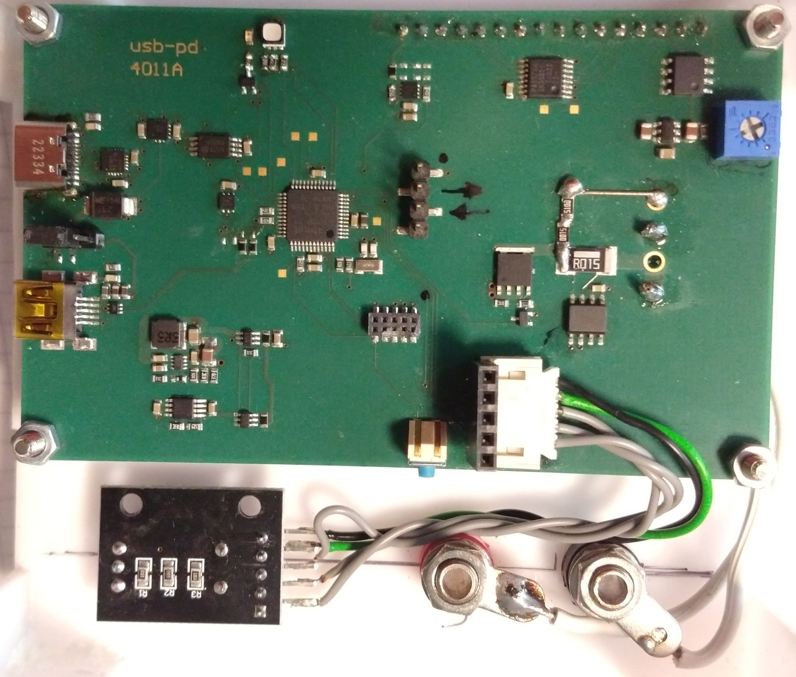
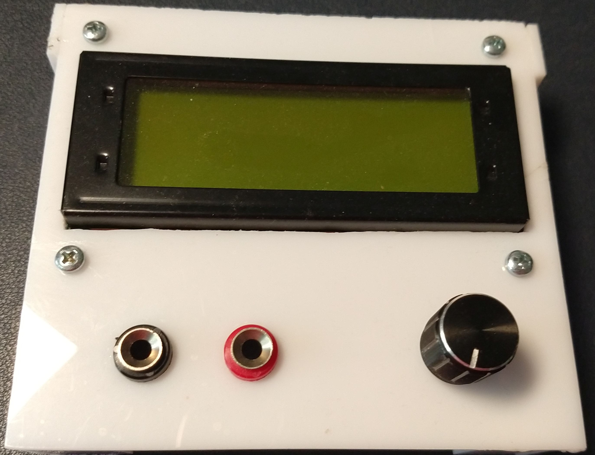

# ARM Prototype V1.0

#### Table of contents
- [ARM prototype](#ARM-prototype)
  - [the first ARM hardware](#the-first-ARM-hardware)
  - [necessary rework on first ARM hardware](#necessary-rework-on-first-ARM-hardware)

## ARM prototype
After my setbacks I tried an Arduino Zero. This board uses the ATSAMD21G18 which is a Cortex M0+ ARM controller running at 
48 MHz. It has 256 kB FLASH and 32 kB RAM and lots of interfaces.
A quick port showed that the SW could be easyly ported from AVR to ARM with almost no issues.

This was the point where we decided to start our first custom PCB avoiding all the problems encountered with the first portotype.
- the CPU runs at 48 MHz @ 3.3 V, so ther is no need for slowing down the CPU wenn reducing the input voltage
- a RGB LED was added to indicate the state of operation
- a CAT4004 was added to control the LCD backlight (we expect a  voltage drop below 4 V Vbus)
- a LM2664 replaced the Villard / Greinacher circuit and frees a port pin
- a USB typ C connector is exclusively used for power supply (using VBUS and CC pins)
- a dedicated protection circuit for USB C pins
- a micro USB connector is used for SW Update and USB to Serial conversion
- the core voltage supply is selctable between USB C und micro USB. so SW Update is possible even when no USB C is connected
- a temperature sensor
- a hardware UART port (Rx/Tx/GND) at 3.3 V level
- some testpads

some headache cause the Vcc supply. Most buck converter circuits need some voltage headroom to operate and "feature" an 
undervoltage lockout circuit. But this is a no go for this circuit. It needs to operate to as low as 3.3 V Vbus. We need an 
undervoltage bypass curcuit to guarantee operation at 3.3 V Vbus. Otherwise the circuit would lock out when VBUS drops below the 
thresholt which is typically 4 V - 4.7 V at 3.3 V output.  
This problem was solved slightly overengineered. We used two 3.3 V regulators which are ored by to ideal diodes.  
The TPS62932 is configured to output 3.45 V. The UVLO is set to 4.55 V and the Enable is set to 5.06 V. This guarantees 
the buck converter operate above 5 V and outputs slightly above 3.3 V so the 3.3 V LDO is disabled savely. The LDO is a 
NCV2951ACDMR2G set to 3.3 V. The dropout voltage is max 450 mV at 100 mA. The current consumption of the circuit is below 50 mA
so we will have an estimated max dropout of 300 mV.   
When the input Voltage is above 5.06 V the LDO is idle and the Vcc is 3.45 V. When the input voltag drops below 4.55 V the buck
converter is disabled and the LDO takes ove, resulting in a Vcc of 3.3 V. When the input voltoge continues to fall, Vcc will 
drop to ~3 V at 3.3 V Vbus.  
The CPU will savely operate down to 2.7 V depending on the brownout settings.

### the first ARM hardware

[schematics](../SAM/hardware/firs_arm/14011_0_USB-PD_Sch.pdf)

The PCBA:  
  
  
A working prototype:  
   

### necessary rework on first ARM hardware
- The output needs a pull down to get a proper zero reading. In order to not to influce the curren measurement the resistor needs 
to be place between the shunt and the power FET.
- the series resistors of the RGB LED need to be matched to the relative brightness
- the current selection of the CAT4004 should be set to ~12 mA / channel, no parallel operation
- the current for the amber LED shall be set to 2 mA ~750R
- the three bin jumper should be populatet instead or R25 
- capacitors have to be added to the rotary encoder switch clock and data pins

[home](../README.md)
