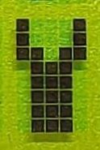
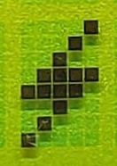
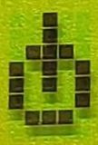

# AVR Menu

#### Table of contents
- [menu icons](#menu-icons)
- [main menu](#main-menu)
- [profile menu](#profile-menu)
- [settings menu](#settings-menu)
- [calibration menu](#calibration-menu)

### the menu

#### menu icons

- menu icons
    - ramp: main menu    
      
    - wrench: settings menu  
      
    - flash, profile menu  
      
    - mark symbol: calibration menu  
      
- action icons 
    - check mark: accept modification to values  
      
    - cancel "x": discard changes made to values  
      
    - dustbin: clear all settings, reset to default  
      
    - switch: enable or disable output  
      
- option icons  
    - ramp: slecect automatic voltage power selection after power loss    
      
	- switch: select automatic output enabling after power loss  
	  
    - regulator: regulator setttings  
      
    - asterisk: brightness selection  
      
	


#### startup message
On startup the system will display a version and build message before starting in main menu.
```
 PD/PPS-Controller  
====================
Ver. :   3.3 nbl    
Build:   mmm dd yyyy
```

after initializiation is completed the main menu will be displayed

#### main menu
```
Mode (x:...) [UI^] ! 
     UU.UU V  I.II A
OUT  UU.UU V  I.II A
[i  i  i  i  i]  (i)
```
last line i: menu icons

to select a menu item press the button, a cursor will appear. Turn rotary switch until 
cursor is at the position of the desired item. Press button again to select the menu.
In this menu the "V" and "A" in the second line are menu items too.
Select to adjust desired voltage or current.

- first line  
The currently selcted profile type will be displayed.  
in this case it is a fixed profile.
If an augmented profile is selcted the selected regulater mode will be displayed at the end
of the line.
    - U means constant voltage
    - UI means constant voltage and current limited by SW and PS hardware.
    - UI^ means constant voltage and current limited in SW, no hw support
	- an exclamation mark will be displayed when current limiting is active
- second line  
The selected voltage and current rating is displayed.
- third line  
The output voltage and current is displayed  
- fourth line  
The available menu item are listed in []. The current menu is displayed at the end of the line in ()  
    1. icon: switch  
    select to turn the output on or off.
    2. icon: flash  
    select to enter the profile menu
    3. icon: wrench  
    select to enter settings menu
    4. icon: check mark  
    when voltage or current settings have been modified only icon 4 and 5 ar active. One need to 
    either accept or discard the changes
    5. icon: cancel "x" 
    see icon 4
    6. icon: ramp
    Current menu. The ramp icon indicates the increment or decrement function of the main menu.

#### profile menu
this menu is used to select the desired PD profile.
```
 # 1 / n  (...)     
U= UU.UU V - UU.UU V
I=  I.II A max      
[i  i  i]        (i)
```

last line i: menu icons


to select a profile press the button navigate to the "#" symbol in the first line and press 
again to enter profile selection. Turning will step through avalabla profiles. To select a 
profile press again and navigate to the check mark in the buttom line or select "x" to abort.

- first line  
The number of the current profile, the total number of profiles and the profile type (fixed, augmented ...)
is displayed   
- second line  
The nominal voltage or voltage range of the current profile is displayed  
- third line  
The maximum available current in the profile is displayed
- fourth line 
The available menu item are listed in []. The current menu is displayed at the end of the line in ()  
    1. icon: ramp  
    select to return to main menu.
    2. icon: check mark  
    select to accept the new profile
    3. icon: cancel "x"  
	select to discard changes  
    4. icon: flash  
	current menu. The flash indicates the power profile selction menu


#### settings menu
This menu is used to change the operation mode or calibration value.
``` 
(i)=auto  (*)=.    *
(i)=auto            
(i)=auto            
[i  i  i  x]     (i)
```

[i] or (i) icons in brackets 

- first line  
    - ramp icon for slecting automatic or manual voltage selction after power loss
    - star icon for brightness selection as bar between "o" = min and "*" = max
- second line  	
  switch icon for selection automatic or manual enabling of the output after power loss
- third line  
  regulator icon for enabeling regulator mode: none, CV, CV+CC, CV+CC max 
- fourth line 
The available menu item are listed in []. The current menu is displayed at the end of the line in ()  
    1. icon: ramp  
    select to return to main menu.
	2. icon: mark symbol  
	select to enter calibration menu
    3. icon: check mark  
    select to accept the new settings
    4. icon: cancel "x"  
	select to discard changes  
    5. icon: wrench  
	current menu. The wrench indicates the settings menu


#### calibration menu
```
I= I.III A:  I.III A
                    
                    
[i  i  i  x]     (i)
```
[i] or (i) icons in brackets 

to adjust the current measurment calibration enable output with a load and use a calibrated ampere meter to measure the current.  
enter the settings menu and go to the calibration menu. enter the measured current and select the checkmark
it is reccommended to chose a current as high as possible to gain maximum precision.

- first line  
    - left value
	  last calibration value (editable)
    - right value
	  recent current measurement
- fourth line 
The available menu item are listed in []. The current menu is displayed at the end of the line in ()  
    1. icon: ramp  
    select to return to main menu.
	2. icon: dustbin  
    slect to reset to default state, all manual, default calibration value
    3. icon: check mark  
    select to accept the new profile
    4. icon: cancel "x"  
	select to discard changes  
    5. icon: mark symbol  
	current menu. 


[home](../README.md)