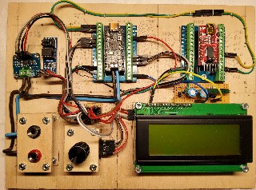
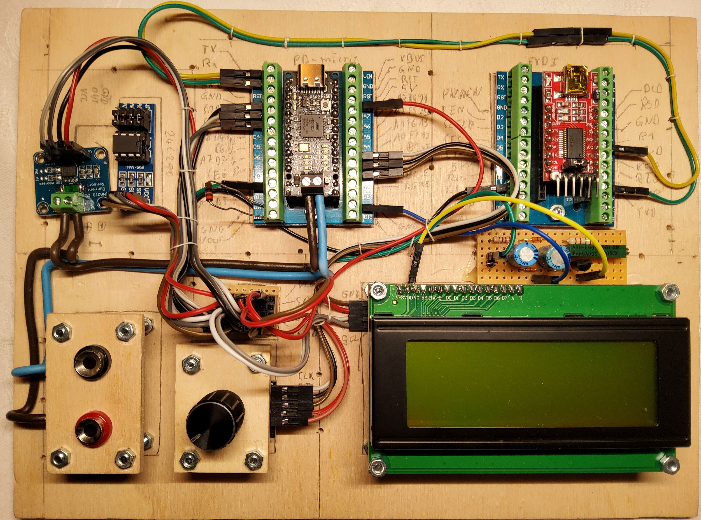
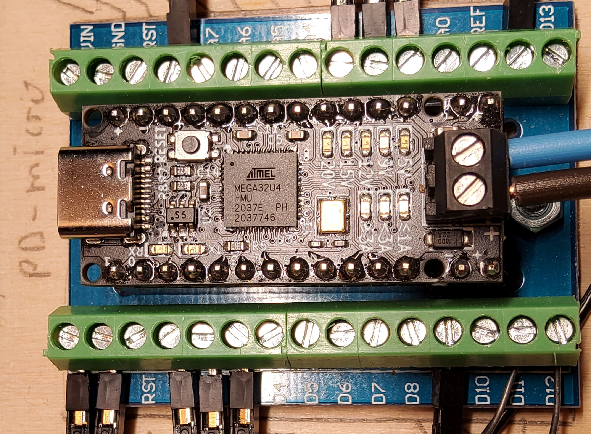
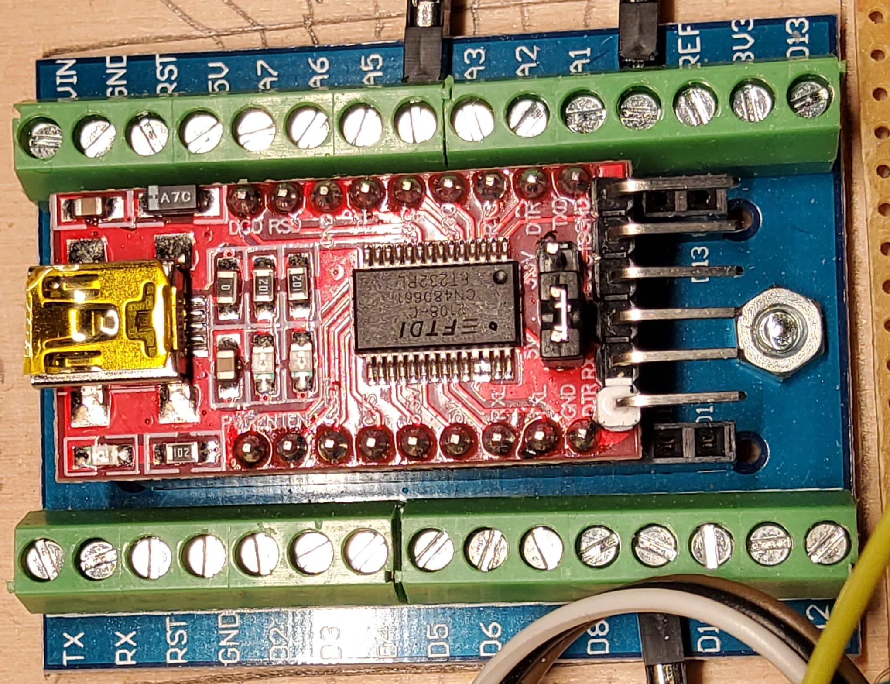

## avr prototype

##### Table of contents
- [the hardware](#the-hardware)
	- [voltage and current sensor](#voltage-and-current-sensor)
	- [PD-Micro](#PD-Micro)
	- [FT232](#FT232)
	- [LCD](#LCD)
	- [switch](#switch)
- [the features](#the-features)
	- [basic features](#basic-features)
	- [advanced features](#advanced-features)

### the hardware
  

and here are the components clockwise beginnign with the upper left.  

#### voltage and current sensor
  
This is the voltage and current sensor. The shunt resistor has been reduced to R015 to get a 5 A full scale reading.  
There is a serial EEPROM 24C256 on the board. This is used for parameter storage. I could have used the Atmel's on 
chip EEPROM but this has way less wear resistance. I did not know how many write cycles would be needed, so i chose
an externel EEPROM

#### PD-Micro
  
This is the heart of the circuit. 

#### FT232

The USB - C port of the PD-Micro is occupied by the power supply. The USB interface can't be use for communication.
The HW serial interface is therefore wired to an FT232 USB to serial chip.

#### LCD
  
This is an 20x4 HD44780 compatible display with PCF8574, voltage inverter and current source for contrast as described 
in my [LCD library](https://github.com/Ueberspannung/LCD44780).

#### switch
left to the display there is a [KY-040](https://github.com/Ueberspannung/RotaryEncoderSwitch) rotary encoder switch. 
Right above the switch there is just a I2C and VCC bus bar.  

### the features
What features does a lab power supply need?  
- adjustable voltage in constant voltage mode
- adjustable current in constant current mode
- automatic switching from constant voltage to constant current and vice versa

#### basic feautres
- it has to be possible to adjust voltage and current settings
    - there needs to be a possibility to selct a profile  
      - when selecting a fixed profile there are no further options  
	    a fixed profile wil be requested with maximum available current
	  - when selecting an augmented profile voltage and current can be selected

#### advanced features
- providing "regulated" output (only possible with augmented profile)  
  this will be optional. There will be four options
    - no regulation  
      the system will set the selected value only
    - constant voltage  
      the system will try to adjust the output voltage within 20 mV  
      no active current limiting will be used. This will be done 
      by the power supply.	  
    - constant voltage and constant current
	  when the current exceeds the desired value the voltage will be reduced  
	  this will be assisted by the power suplly's current limiting function
    - constant voltage and constant current maximum
	  in this mode the current limiting of the power supply will be set to max.  
	  The current limiting is done in sw only. This prevents the power supply from
	  going into overcurrent shutdown
- automatic resume after power loss
    - no automatic resume
	  the system will start in default profile (5 V) with power switch off
    - automatic resume voltage
	  the system will restore the last power setting but keeps the power switch off
	- automatic power on
	  the last power settings will be restored and the power switch will be turned on
- calibration of the current measurent  
  When drawing a known current form the circuit one can calibrate the current measurement
  by entering ths specific value
- brightness adjustment of the display

[home](../README.md)