# Mini Menu

#### Table of contents
- [menu icons](#menu-icons)
- [main menu](#main-menu)
- [profile menu](#profile-menu)
- [settings menu](#settings-menu)
- [calibration menu](#calibration-menu)

### the menu

#### menu icons

- menu icons
    - ramp: main menu    
      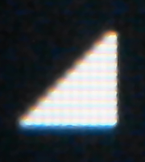
    - wrench: settings menu  
      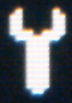
    - flash, profile menu  
      
    - mark symbol: calibration menu  
      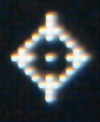
- action icons 
    - check mark: accept modification to values  
      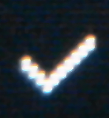
    - cancel: discard changes made to values  
      
    - dustbin: clear all settings, reset to default  
      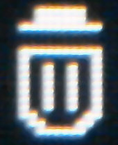
    - switch: enable or disable output  
      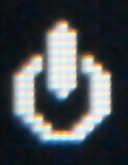
- option icons  
    - ramp: slecect automatic voltage power selection after power loss    
      
	- switch: select automatic output enabling after power loss  
	  
    - regulator: regulator setttings  
      
    - asterisk: brightness selection  
      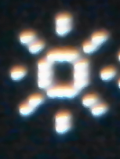
- other icons
    - SD-Card: sd card has been detected and is operational  
      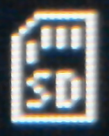
	
	

#### startup message
On startup the system will display a version and build message before starting in main menu.
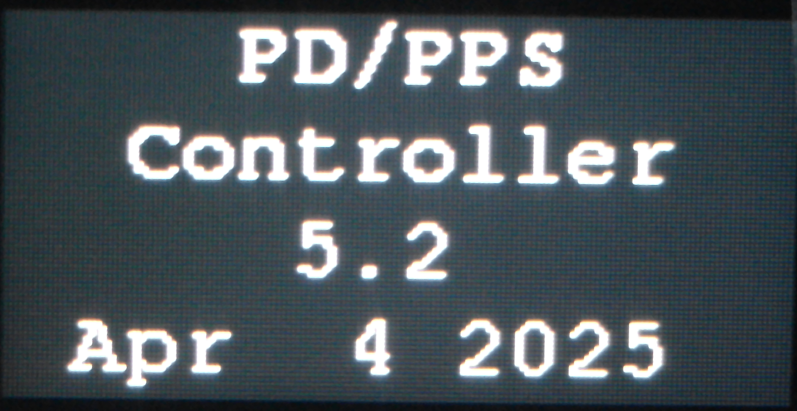

after initializiation is completed the main menu will be displayed

#### main menu

to select a menu item press any the button, a cursor will appear. Press up / down switch until 
cursor is at the position of the desired item. Press button again to select the menu.
In this menu the "V" and "A" in the second and third line are menu items too.
Select to adjust desired voltage or current.

- first line  
The current bus voltage, the profile numer and profile type will be displayed  
In this case it is a fixed profile #3 with ~12V.
If an augmented profile is selcted the selected regulater mode will be displayed at the end
of the line or AUG if no regulator option is selected
    - U means constant voltage
    - UI means constant voltage and current limited by SW and PS hardware.
    - UI^ means constant voltage and current limited in SW, no hw support
	- an overcurrent condition will be indicated by red Voltage / Current display
- second line  
The current output voltage and the selected voltage is displayd.  
- third line  
The output current and max. output current is displayed  
- fourth line  

The color of output voltage and current display is the same as the LED 
- grey - if switched of  
    
- green - in FIX profile mode
  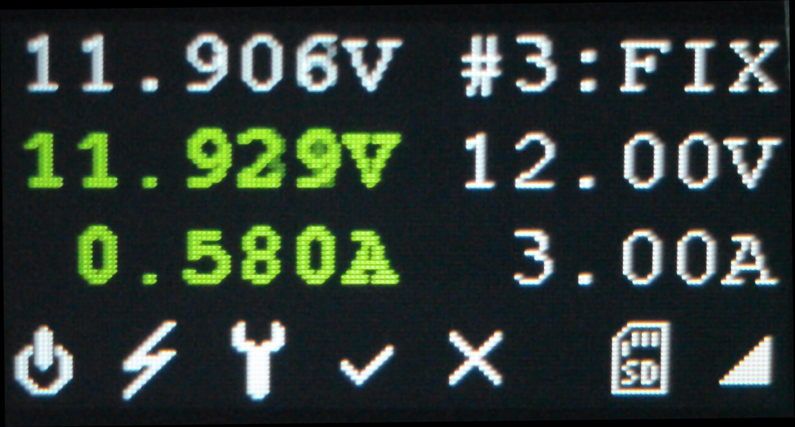  
- yellow - in unregulated augmented mode  
  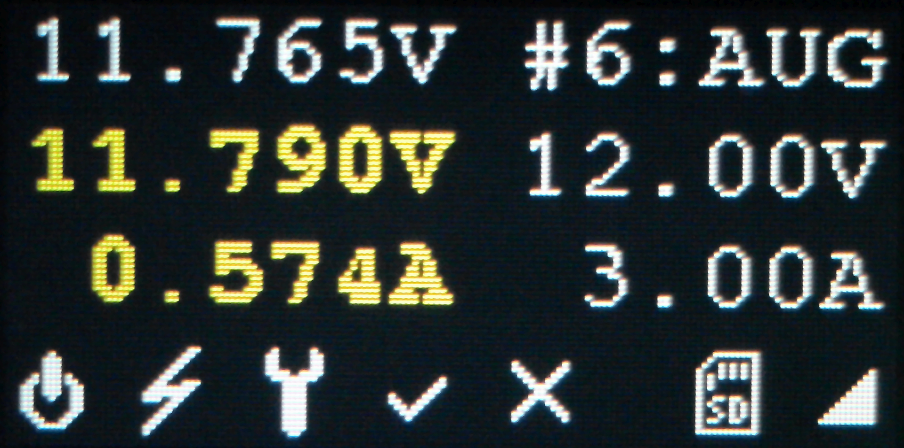  
- blue - regulated augmented mode  
  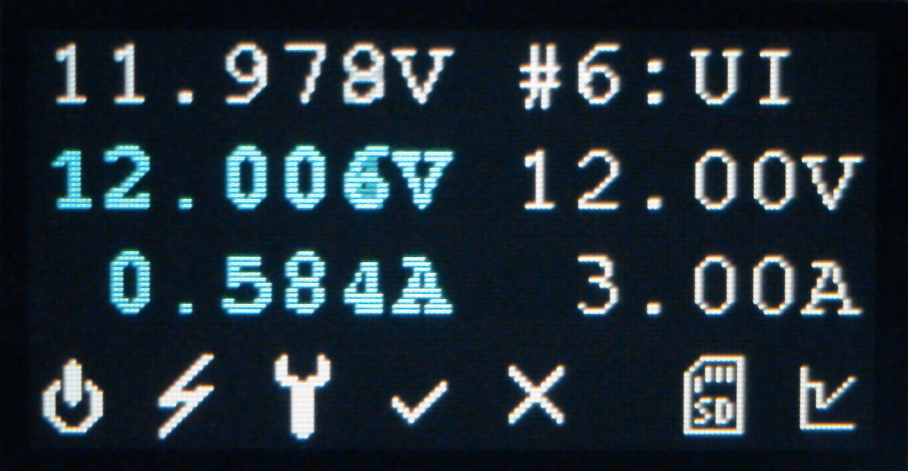  
- red - currentlimiting regulated augmented mode  
  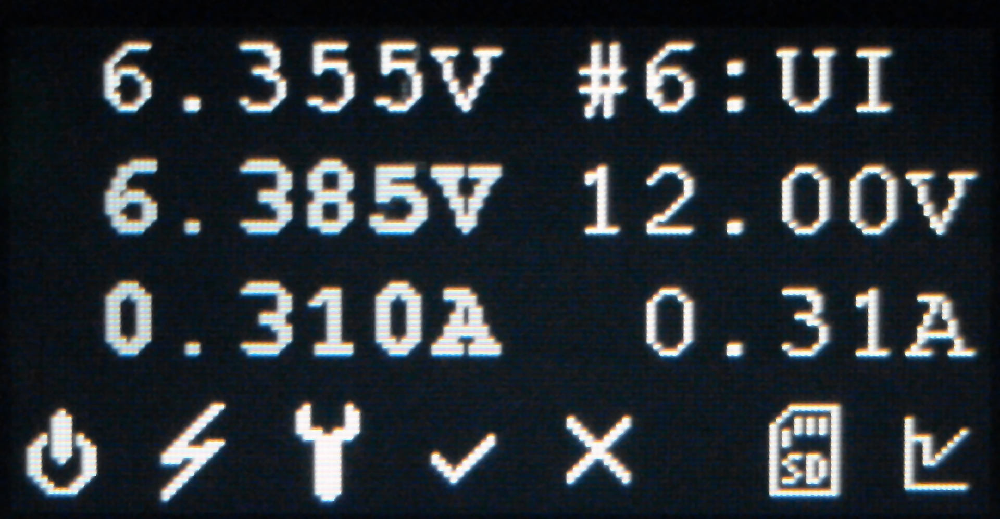  
  

The available menu item are on the left. The current menu is displayed at the end of the line.  
 1. icon: switch  
    select to turn the output on or off.  
 2. icon: flash  
    select to enter the profile menu  
 3. icon: wrench  
    select to enter settings menu  
 4. icon: check mark  
    when voltage or current settings have been modified only icon 4 and 5 ar active. One need to 
    either accept or discard the changes  
 5. icon: cancel  
    see icon 4  
 6. icon SD-Card (ore none)  
	indicates if an SD CArd has been detected  
 7. icon: ramp or regulator  
    The ramp icon indicates the main menu in non regulated mode  

#### profile menu
this menu is used to select the desired PD profile.
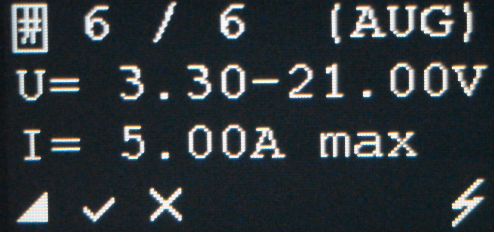

to select a profile press the button navigate to the "#" symbol in the first line and press 
again to enter profile selection. Pressing up / down will step through avalabla profiles. To select a 
profile press again and navigate to the check mark in the buttom line or select cancel to abort.

- first line  
The number of the current profile, the total number of profiles and the profile type (fixed, augmented ...)
is displayed   
- second line  
The nominal voltage or voltage range of the current profile is displayed  
- third line  
The maximum available current in the profile is displayed
- fourth line 
The available menu item are listed on the left. The current menu is displayed at the end of the line    
 1. icon: ramp  
    select to return to main menu.
 2. icon: check mark  
    select to accept the new profile
 3. icon: cancel   
	select to discard changes  
 4. icon: flash  
	current menu. The flash indicates the power profile selction menu

#### settings menu
This menu is used to change the operation mode or calibration value.
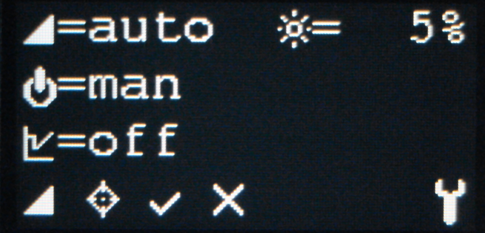

- first line  
    - ramp icon for slecting automatic or manual voltage selction after power loss
    - star icon for brightness selection as % of max brighness. The brightness is 
	  changend in steps defined by the CAT4004 LED controller
- second line  	
  switch icon for selection automatic or manual enabling of the output after power loss
- third line  
  regulator icon for enabeling regulator mode: none, CV, CV+CC, CV+CC max 
- fourth line 
The available menu item are listed on the right. The current menu is displayed at the end of the line  
    1. icon: ramp  
    select to return to main menu.
	2. icon: mark symbol  
	select to enter calibration menu
    3. icon: check mark  
    select to accept the new settings
    4. icon: cancel 
	select to discard changes  
    5. icon: wrench  
	current menu. The wrench indicates the settings menu

#### calibration menu
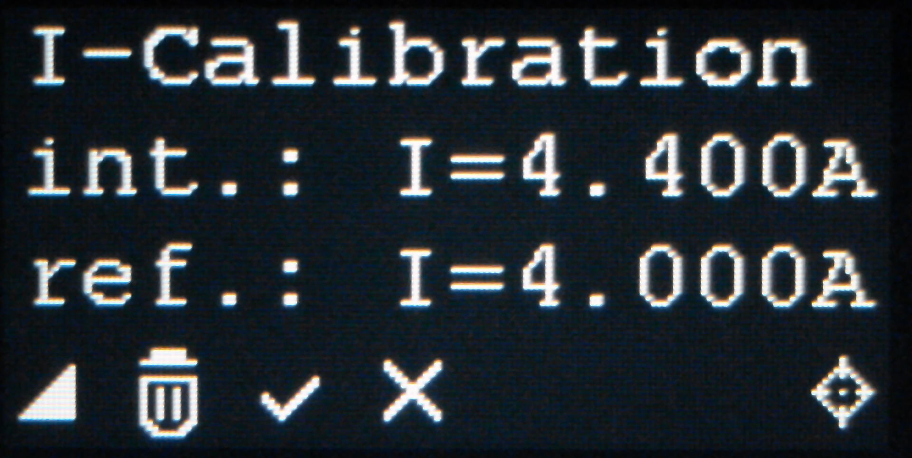

to adjust the current measurment calibration enable output with a load and use a calibrated ampere 
meter to measure the current.   E
Enter the settings menu and go to the calibration menu. 
If there has been alreade an calibration been danoe (Value different form 5 A ) slecect the 
dustbin to clear any data and restart the system.  
Select the (A) of the reference current, enter the measured current and select the checkmark. The 
internal measurement will automatically be inserted.
It is reccommended to chose a current as high as possible to gain maximum precision.

- first line  
  menu name  
- second line  
  internal current value  
- third line  
  reference curren measured with externel ampere meter
- fourth line   
  menu icons

The available menu item are listed on the right. The current menu is displayed at the end of the line    
1. icon: ramp  
   select to return to main menu.  
2. icon: dustbin  
   slect to reset to default state, all manual, default calibration value  
3. icon: check mark  
   select to accept the new profile  
4. icon: cancel  
   select to discard changes  
5. icon: mark symbol  
   current menu. 

[home](../README.md)