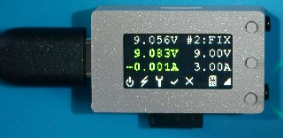
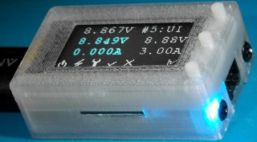
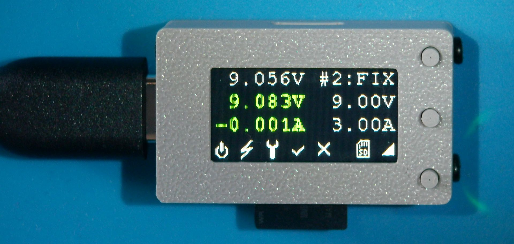
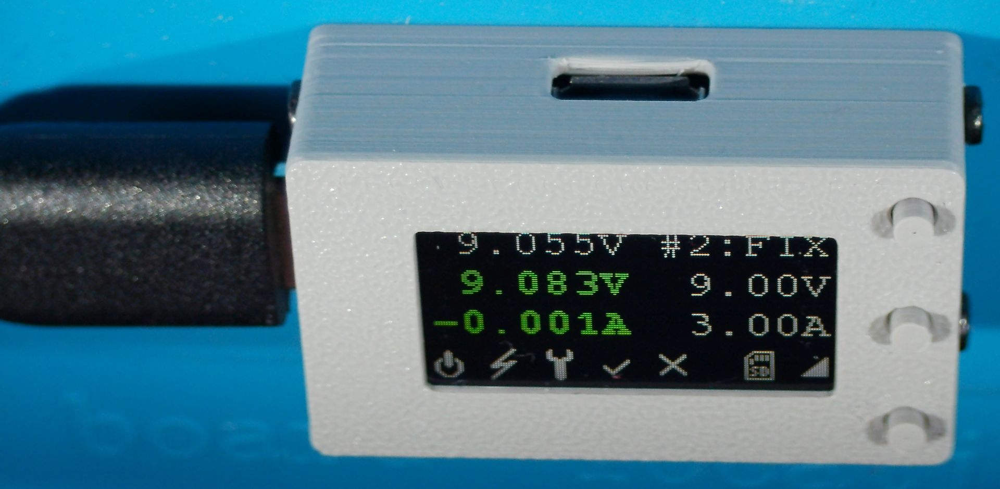
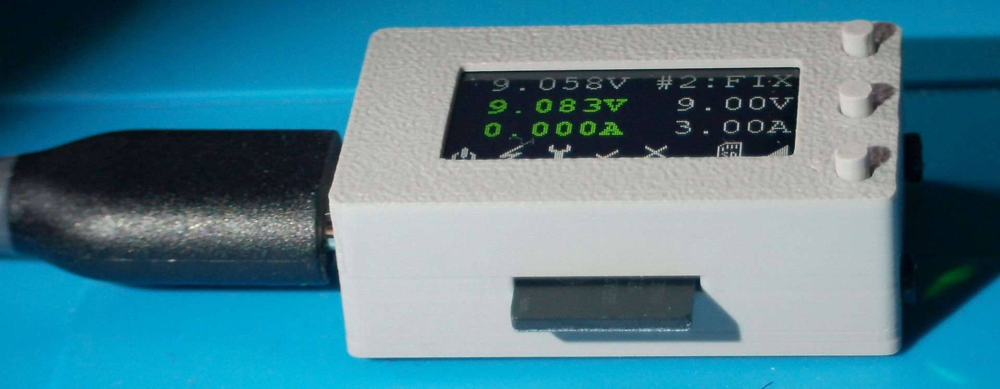
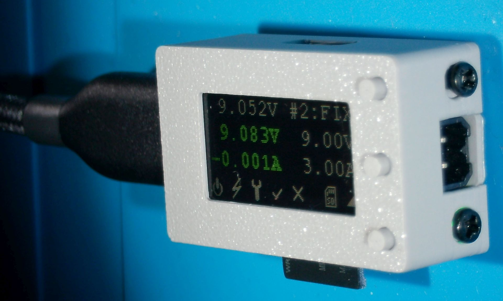

# The Mini

#### Table of contents
- [mini prototype](#mini-prototype)
  - [the mini hardware](#the-mini-ARM-hardware)
  - [necessary rework on mini](#necessary-rework-on-mini)

## mini prototype
After the [first arm protoype](./arm01.md) we did some major changes

- small size for in cable application, only 32.5 x 18.5 x 10 mm PCB + display
- only one dcdc suplly for cpu capable of full input voltage range and bypassing 
  the regulator on low input voltage
- 0.96" 160x80 pixels color LCD
- three dedicated buttons (OK / UP / DOWN) instead of rotary encoder button
- SD Card slot
- speeker (resonant at 4 kHz)
- INA232 instead of INA219 for improoved accuracy
- Accelerometer for alternative handling
- Audidecoder (currently not supported)

Some I/Os and interfaces not enabled on the Arduino Zero are used. Therefore a 
new board has to be created. See [description of the mini variant](./sw.md#description-of-the-mini-variant)
for details

and here it is: (click on image for larger image)  
  
  
  
  

 
### the mini hardware

[schematics](../SAM/hardware/mini/14021_default_pdmicroMini_Sch.pdf)

The PCBA:  (click on image for larger image)

  

for some more images see [the-mini-menu](./mini-menu.md)  

### necessary rework on first ARM hardware
- when designing the mini we omittted the eeprom.   
  This was a bad decision. It now cannot be calibrated wihout SD card. it is 
  possible to swap Cards between modules and therefore calibration files. It is much
  more convenient to storethe calibration data on the module and not on an interchangeable 
  storage
- due to a last minute change to the reference voltage, the voltage devider for the bus 
  voltage is not suitable for the desired input voltage. It maxes out on ~14V. 
- the reset button is crap, it should be replaced with the menu buttons
- the driver for the speaker is not suitable for the required loadm, needs to be replaced

[home](../README.md)
