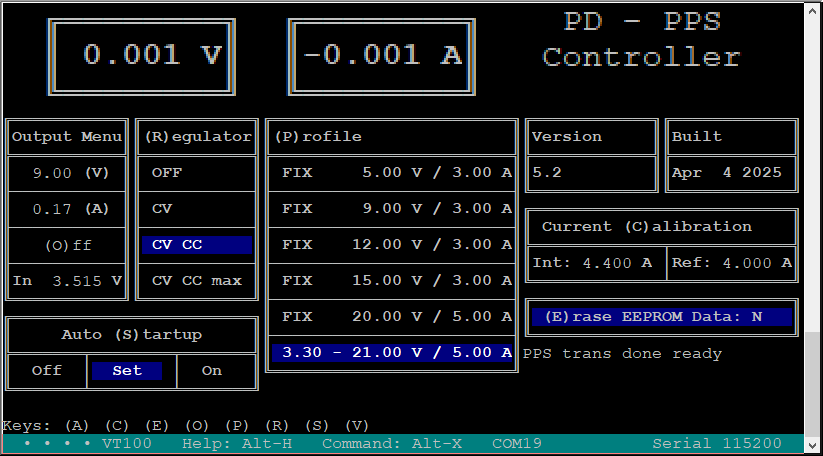

# The Terminal Menu

#### Table of contents
- [PC - Control](#PC-Control)
- [requirements](#requirements)
- [suitalble terminal programs](#suitable-terminal-programs)
- [screenshots](#screenshots)
  - [PuTTY - PPS, CV CC no load](#PuTTY-PPS-mode-no-load)
  - [PuTTY - PPS, CV CC load](#PuTTY-PPS-mode-load)
  - [PuTTY - PPS, CV CC overload](##PuTTY-PPS-mode-overload)
  - [PuTTY - PPS, no load](#PuTTY-PPS)
  - [PuTTY - FIX, no load](#PuTTY-FIX)
  - [Kermit](#kermit)
- [Description](#description)
  - [output menu](#output-menu)
  - [regulator mode](#regulator-mode)
  - [autostart settings](#autostart settings)
  - [profile](#profile)
  - [calibration](#calibration)

## PC Control
the new unified firmware supports PC control on all ARM versions.  
The built in USB Port is configured as serial port. This port is monitored 
by the firmware. if it is opened with a terminal program the frimware switches 
to remote mode disabling the interface on the board but still displaying data.
All settings can be done via the terminal interface.   
The controlls on the device are reenabled when the port ist closed.

## requirements
the firmware is designed to operate wth a VT100 compatible terminal. Although 
not necessary on USB serial ports the serial parameters are 115200Bd, 8 databits, 
no parity, one stopbit.  
The terminal needs to be set to CP437, otherwise the grafic symbols will not be displayed
local echo has to be disabled.  
CR/LF translation is not required and should be disabled.  
Terminal size is 80 x characters by 24 lines.

## suitable terminal programs
The PC UI has succesfully been tested with [PuTTY](https://putty.org/) or [Kermit](https://www.kermitproject.org/). 
[TeraTerm](https://github.com/TeraTermProject) might work but there are some issues. Kermit and PuTTY work just fine.

## screenshots
### PuTTY PPS mode no load

### PuTTY PPS mode load

### PuTTY PPS mode overload

### PuTTY PPS 

### PuTTY FIX 

### Kermit

# description
## meter display
On top there are two display boxes displaying the current output voltage and load. The display has the following colors (matched to the LCD and LED)
 - grey  
   output off, LED off
 - green  
   output on, FIX mode
 - yellow  
   output on PPS mode unregulated
 - cyan  
   output on PPS mode regulation CV, CV CC or CV CC max
 - red 
   output on PPS mode curren regulation active (**CV CC** or **CV CC max** only)

## output menu
In the output menu the following parameters are displayed
 - output voltage setpoint (editable in PPS mode)
 - output current setpoint (editable in PPS mode)
 - output switch (on / off)
 - bus voltage (measure on CPU ADC)

## reguator mode
The behaviour of the SW regulation can be selected in this menu. Althoug changes can be made in any confiruation they will only affect the PPS mode.  
possible selections are
 - OFF  
   no compensation of voltage drop
 - CV  
   constant voltage, set within +-20mV
 - CV CC 
   constant voltage with current limiting, accuracy is 20mV/R  
   limit is set to PD source so transients may trigger PD source overlaod  
 - CV CC max  
   current limit is processed in SW only  
   PD source is set to max current so triggering the PD oveload is less likely
   
The iteration cycle depends on th PD source. My is approx 40 ms.

## Autostrat settings
this settings can be used to define the behaviour on power up. 
 - It can be eithe disabled (OFF)
 - set to restore the last power settings while keeping the output off (SET)
 - restore the last power settings and the last output switch configuration

## Profile
this menu depends on the PD source capabilities. Ony available modes will be listed

## Calibration
depending on the quality of the shunt resistor an addition calibration is possible
 1. reset the contents of the configuration memory
 1. select a voltage / resistor combination as close as posiible to the maximum current
 1. enable the output and measre the current with a suitable amperemeter
 1. press c, the internal reading will be inserted, enter the amperemeter reading
 1. press enter 
 1. done
 
 
[home](..readme.md)