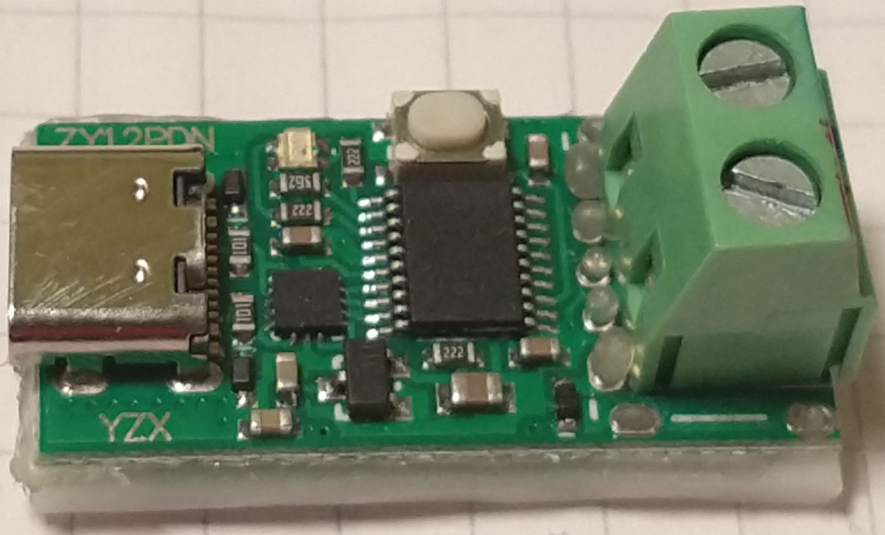
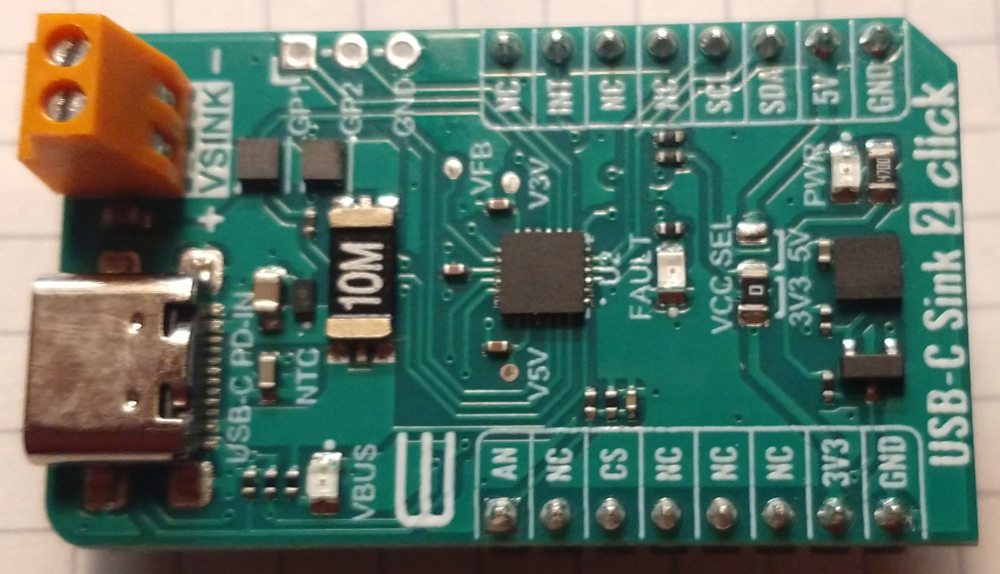
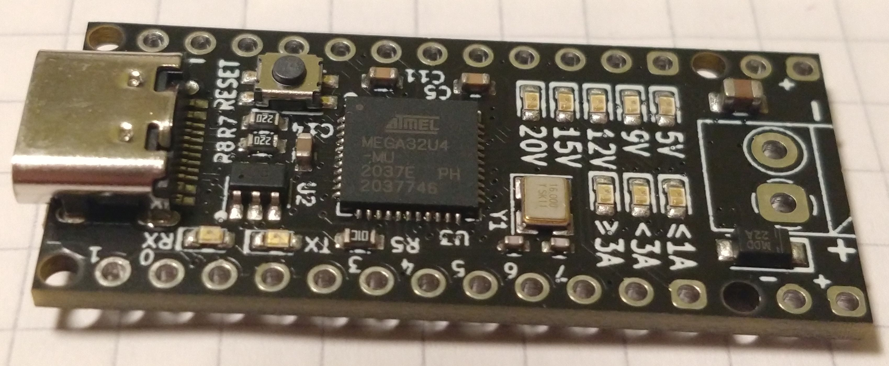
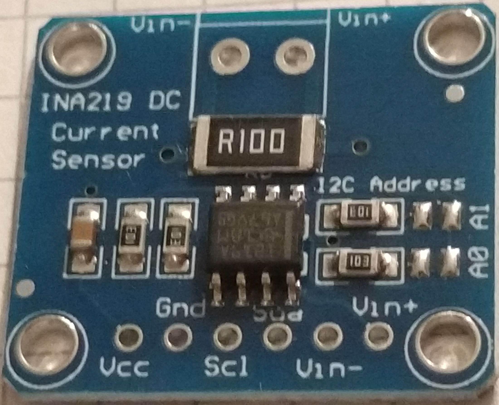
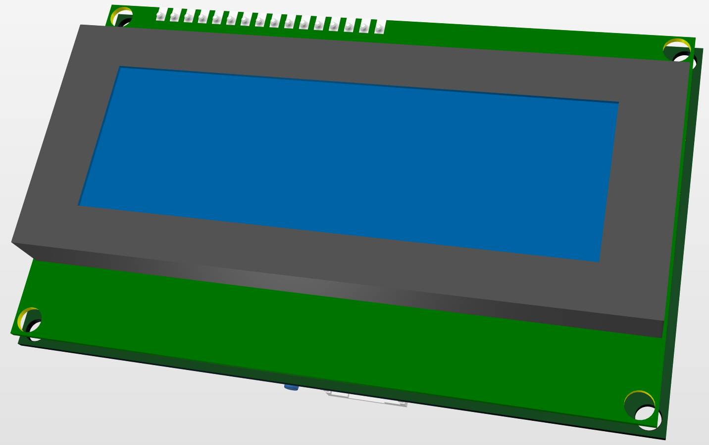
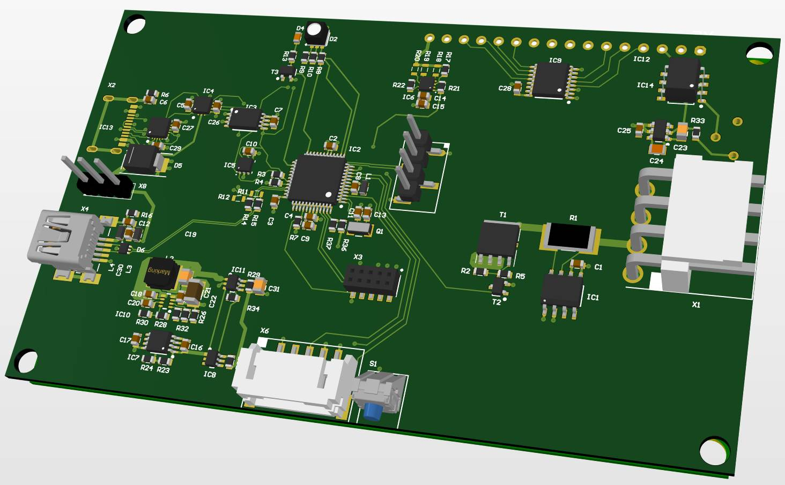

# PD-PPS-Controller
Interface for USB Type C Chargers with PD/PPS

##### Table of contents
- [credits](#credits)
- [motivation](#motivation)
- [hardware](#hardware)
	- [AVR prototype](./DOC/avr.md#Table-of-contents)
		- [the hardware](./DOC/#the-hardware)
			- [voltage and current sensor](./DOC/#voltage-and-current-sensor)
			- [PD-Micro](./DOC/#PD-Micro)
			- [FT232](./DOC/#FT232)
			- [LCD](./DOC/avr.md#LCD)
			- [switch](./DOC/avr.md/#switch)
		- [the features](./DOC/avr.md/#the-features)
			- [basic features](./DOC/avr.md/#basic-features)
			- [advanced features](./DOC/avr.md/#advanced-features)
	- [first ARM prototype](./DOC/arm01.md#Table-of-contents)
		- [the first ARM hardware](./DOC/arm01.md#the-first-ARM-hardware)
		- [necessary rework on first ARM hardware](./DOC/arm01.md#necessary-rework-on-first-ARM-hardware)
	- [the mini](#the-mini)
		- [new hardware features](#features)
		
		
- [The menu][#menu]
	- [avr menu](./DOC/avr-menu.md)
		- [menu icons](./DOC/avr-menu.md#menu-icons)
		- [main menu](./DOC/avr-menu.md#main-menu)
		- [profile menu](./DOC/avr-menu.md#profile-menu)
		- [settings menu](./DOC/avr-menu.md#settings-menu)
		- [calibration menu](./DOC/avr-menu.md#calibration-menu)
	- [arm menu V1.0](./DOC/arm01-menu.md)
	    - [menu modifications](#menu-modifications)
        - [new calibration menu](#new-calibration-menu)
	- [Terminal menu](./DOC/terminal.md#table-of-contents)
		- [requirements](./DOC/terminal.md#table-of-contents)
		- [suitalble terminal programs](./DOC/terminal.md#suitable-terminal-programs)
		- [screenshots](./DOC/terminal.md#screenshots)
		  - [PuTTY - PPS, CV CC no load](./DOC/terminal.md#PuTTY-PPS-mode-no-load)
		  - [PuTTY - PPS, CV CC load](./DOC/terminal.md#PuTTY-PPS-mode-load)
		  - [PuTTY - PPS, CV CC overload](./DOC/terminal.md#PuTTY-PPS-mode-overload)
		  - [Kermit](./DOC/terminal.md#kermit)
		- [Description](./DOC/terminal.md#description)
		
- [The software](./DOC/sw.md)
  - [AVR SW](./DOC/sw.md#AVR-SW)
    - [build instructions](./DOC/sw.md#AVR-build-instructions)
  - [first ARM prototype SW](./DOC/sw.md#first-ARM-prototype-SW)
    - [first ARM prototype SW](./DOC/sw.md#first-ARM-prototype-SW) 
    - [work in progress](./DOC/sw.md#work-in-progress)
	- [build instructions](./DOC/sw.md#first-ARM-prototyp-SW-build-instructions)
  - [unified sw](./DOC/sw.md#unified-sw)

- [comment on USB type C chargers](#comment-on-USB-type-C-chargers)
    - [tested chargers](#tested-chargers)
    - [issues](#issues)
        - [power supply resets](#power-supply-resets)
        - [power bank resets after 10s](#power-bank-resets-after-10s)

## credits
This project originates in a colaboration with [embres GmbH](https://www.embres.de/).  
They did a great job in 
- supporting in sourcing of parts
- PCB desgin
- manufacturing PCBs


## motivation
There are some interesting boards out there to trigger USB Type C power delivery sources. Such as the ZY12PDN.  
  
You can find many details at [Manuel Bl.](https://github.com/manuelbl/zy12pdn-oss). These modules allow you to
step through the available fixed profiles which include 5 V, 9 V, 12 V, 15 V and 20 V.
There are many others out there, some have selectable voltage through resistors or jumpers.  
I managed to get my hands on one the utilises a HUSB238 chip from [Hynetek](https://en.hynetek.com/). This one
is programmable either through resistors or a microcontroller using I2C.  

Unfortunatly this is well  below the capabilities of a PD 3.0 compliant power supply. All these modules use only so 
called fixed profiles. But there is the PPS Mode (porgrammable power supply). This uses the augmented profile.
The Augmented Profiles is spacified from 3.3 V to 21 V and up to 5 A. The voltage can be selected in 20 mV steps
and the maximum current can be selected in 50 mA steps.  

And here is my idea: Have you ever used one of those chunky lab power supplies eating up most space on your desk?
These power supplies often range from 0 - 30 V and 0 - 5 A. As far as I am concerned, I mostly use 5 - 15 V at a
few amps.  

What if we can use this augmented profile to mimic a lab power supply? We would need a chip which is capable of 
requesting this profile from a suitable PPS capable USB Type C power supply.  
Well there is the easy and the hard way:  
The easy way would be to tell some chip to request the desired voltage form the power supply.  

Such a chip is the AP33772 available from [Diodes Incorporated](https://www.diodes.com/). You can get a dedicated 
evaluation board form Diodes or other manufacturers eg. [MICROE](https://www.mikroe.com/). This is the 
***USB-C sink 2 click*** form MICROE:  
  
This chip has been marked as NRND and was replaced by the AP33772S. The "S" version is even easier to use but has a huge
downside: It allows only 100 mV and 250 mA steps.  

The hard way is to use one of those USB-C PD phys. they provide an OSI 0 + 1 interface to the power supply. Higher
levels have to be implemented in SW. The most commonly used chip seems to be the FUSB302 form 
[ON Semiconductor](https://www.onsemi.com/). This chip was used in the original ZY12PDN.

And here it is:  
  
This is the [PD-Micro](https://github.com/ryan-ma/PD_Micro) deigned by Ryan Ma. It is Aruduino Pro Micro with
the FUSB302, some LEDs, a power switch and a voltage regulator. Ryan has made it easy to select appropiate 
profiles. [Kai Clemens Liebich](https://github.com/kcl93) has made some improvements to Ryan's
[FUSB302 lib](https://github.com/kcl93/fusb302_arduino).  

The only problem is voltage stability. Even when using 5 A USB C cables the voltage drop is quite significant.
So we might need to measure the output voltage to fine adjust the power supply voltage. The frist idea was to use
the internal ADC with an external 2.048 V voltage eference. The problem is, this is only a 10 bit ADC, but we need
to measure voltages up to 21 V. Assuming we clip at 20.48 V we will have a resolution of 20 mV. This seems to be
just enough but we can easyly do better. When using a dedicated ADC e.g. The INA219  
  
We can improve the precision to 4 mV. This is well below the 20 mV stepsize. An we get an current sensor on top.  
***Warning on current sensor ACS712***  
The ACS 712 is an easy to use isolated current sensor. But:  
- there are many Fake modules out ther using an relabled ACS704. The fake chips can easyly be found by measuring
cuntinuity between pin 5 and 6. In the ACS704 those pins are shorted while in the ACS712 they are not. The ACS712
has improved stability and nois reduction.
- the ACS712 is very sensitive to VCC stability. 
- the ACS712 is bidirectional and therefore centered aroud 2.5 V for 0 A 
- the ACS712 uses magnetic coupling therefore is sensitive to external magnetic fields and may need complex
magnetic shielding  

  

Now we can set a voltage, enable the output and measure the output voltage and current. So we can write a few 
lines of code to implement a constant voltage / current source. Well the reagulator response time will be 
limited by the speed of the power supply but it is within reasonable limits depenting on your USB power supply. 
My PS is an outdated Ugreen Nexode 2 with 100W which switches in ~40 .. 50 ms.  

But how is the voltage and current slectet?
Well we could use a serial interface and a computer to "remote control" the circuit. But what about an LCD a 
rotary switch as UI?.

And this leads me to my first prototype.

## hardware
### AVR prototype
 	
[AVR prototype](./DOC/avr.md#Table-of-contents)
### first ARM prototype
 
[first ARM prototype](./DOC/arm01.md#Table-of-contents)


### the mini

- [avr menu](./DOC/avr-menu.md)
	- [menu icons](./DOC/avr-menu.md#menu-icons)
	- [main menu](./DOC/avr-menu.md#main-menu)
	- [profile menu](./DOC/avr-menu.md#profile-menu)
	- [settings menu](./DOC/avr-menu.md#settings-menu)
	- [calibration menu](./DOC/avr-menu.md#calibration-menu)
- [arm menu V1.0](./DOC/arm01-menu.md)
    - [menu modifications](#menu-modifications)
    - [new calibration menu](#new-calibration-menu)
- [Terminal menu](./DOC/terminal.md#table-of-contents)
	- [requirements](./DOC/terminal.md#table-of-contents)
	- [suitalble terminal programs](./DOC/terminal.md#suitable-terminal-programs)
	- [screenshots](./DOC/terminal.md#screenshots)
	  - [PuTTY - PPS, CV CC no load](./DOC/terminal.md#PuTTY-PPS-mode-no-load)
	  - [PuTTY - PPS, CV CC load](./DOC/terminal.md#PuTTY-PPS-mode-load)
	  - [PuTTY - PPS, CV CC overload](./DOC/terminal.md#PuTTY-PPS-mode-overload)
	  - [Kermit](./DOC/terminal.md#kermit)
	- [Description](./DOC/terminal.md#description)

 
## comment on USB type C chargers
My Charger supports 5 V / 9 V / 12 V / 15 V @ 3A and 20 V @ 5A fixed profiles and 3.3 V - 21 V @ 5 A augmented 
profile. Be careful many chargers marked with 100W (even Ugreen) will only support 65 W PPS (3.25 A) with 
limited voltage range. They may not supprot voltages below 3.3 V. Some will even have two PPS profiles with
differnet voltage / current ratings.

### tested chargers
- UGREEN Nexode 2 Port 100W PD-Charger  (Model CD254 #50827)
  Supported Profiles:  
    - Fixed	 	
	    - 5 V / 3 A, 9 V / 3 A, 12 V / 3 A, 15 V / 3 A, 20 V / 5A
    - Augmented 	
	    - 3.3 - 21 V / 5A 

- UGREEN Nexode 100W Desktop Charger (Model CD328 #90928)
  Supported Profiles:  
    - Fixed  
	    - 5 V / 3 A, 9 V / 3 A, 12 V / 3 A, 15 V / 3 A, 20 V / 5A
    - Augmented  	
	    - 3.3 - 21 V / 5A 
         
- Anker PowerPort I 30W PD  
  Supported Profiles:
  - Fixed 		
      - 5 V / 3 A, 9 V / 3 A, 15 V / 2 A, 20 V / 1.5 A

- iLepo USB C Fast Charger 65 W   
  Supported Profiles  
    - Fixed  
        - 5 V / 3 A, 9 V / 3 A, 12 V / 3A, 15 V / 3 A, 20 V / 3.25 A
    - Augmented  
        - 3.3V - 11V 5A

- INIU Power Bank 20000mAh, 22.5W   
  Supported Profiles
    - Fixed  
        - 5 V / 3 A, 9 V / 2.22 A, 12 V / 1.5 A
    - Augmented  
        -5.0 V - 5.9 V / 3 A
        -5.0 V - 11 V / 2 A

### issues

#### power supply resets
Some power suplly seem to reset the power when no current is drawn.  
My "Nexode 100W Desktop Charger" P/N 90928 resets after ~1 h without load. Other chargers don't.

#### power bank resets after 10s
My INIU Power Bank resets with no load within ~10s   

***log with load 20R***
```
0006: FUSB302 ver ID:B_revA
0118: USB attached CC1 vRd-3.0
0172: RX Src_Cap id=1 raw=0x53A1
0172:  obj0=0x2A01912C
0172:  obj1=0x0002D0E9
0172:  obj2=0x0003C096
0172:  obj3=0xC076323C
0172:  obj4=0xC0DC3228
0172:    [0] 5.00V 3.00A
0172:    [1] 9.00V 2.33A
0172:    [2] 12.00V 1.50A
0172:    [3] 5.00V-5.90V 3.00A PPS *
0172:    [4] 5.00V-11.00V 2.00A PPS
0176: TX Request id=0 raw=0x1082
0176:  obj0=0x42022628
0186: RX GoodCRC id=0 raw=0x0121
0192: RX Accept id=2 raw=0x05A3
0210: RX PS_RDY id=3 raw=0x07A6
0212: PPS 5.50V 2.00A supply ready
0214: Load SW ON
5214: TX Request id=1 raw=0x1282
5214:  obj0=0x42022628
5222: RX GoodCRC id=1 raw=0x0321
5228: RX Accept id=4 raw=0x09A3
5246: RX PS_RDY id=5 raw=0x0BA6
5246: PPS 5.50V 2.00A supply ready
10248:TX Request id=2 raw=0x1482
10248: obj0=0x42022628
10256:RX GoodCRC id=2 raw=0x0521
10262:RX Accept id=6 raw=0x0DA3
10280:RX PS_RDY id=7 raw=0x0FA6
10280:PPS 5.50V 2.00A supply ready
  ...
```

***log without load:***
```
0006: FUSB302 ver ID:B_revA
0118: USB attached CC1 vRd-3.0
0172: RX Src_Cap id=1 raw=0x53A1
0172:  obj0=0x2A01912C
0172:  obj1=0x0002D0E9
0172:  obj2=0x0003C096
0172:  obj3=0xC076323C
0172:  obj4=0xC0DC3228
0172:    [0] 5.00V 3.00A
0172:    [1] 9.00V 2.33A
0172:    [2] 12.00V 1.50A
0172:    [3] 5.00V-5.90V 3.00A PPS *
0172:    [4] 5.00V-11.00V 2.00A PPS
0176: TX Request id=0 raw=0x1082
0176:  obj0=0x42022628
0186: RX GoodCRC id=0 raw=0x0121
0192: RX Accept id=2 raw=0x05A3
0210: RX PS_RDY id=3 raw=0x07A6
0212: PPS 5.50V 2.00A supply ready
0214: Load SW ON
5214: TX Request id=1 raw=0x1282
5214:  obj0=0x42022628
5222: RX GoodCRC id=1 raw=0x0321
5228: RX Accept id=4 raw=0x09A3
5248: RX PS_RDY id=5 raw=0x0BA6
5248: PPS 5.50V 2.00A supply ready
10250:TX Request id=2 raw=0x1482
10250: obj0=0x42022628
10258:RX GoodCRC id=2 raw=0x0521
10264:RX Accept id=6 raw=0x0DA3
10284:RX PS_RDY id=7 raw=0x0FA6
10284:PPS 5.50V 2.00A supply ready

==> The Power bank resets and defaults to 5V only.

0006: FUSB302 ver ID:B_revA
0118: USB attached CC1 vRd-3.0
0352: TX Get_Src_Cap id=0 raw=0x0087
0704: TX Get_Src_Cap id=0 raw=0x0087
1056: TX Get_Src_Cap id=0 raw=0x0087
```

