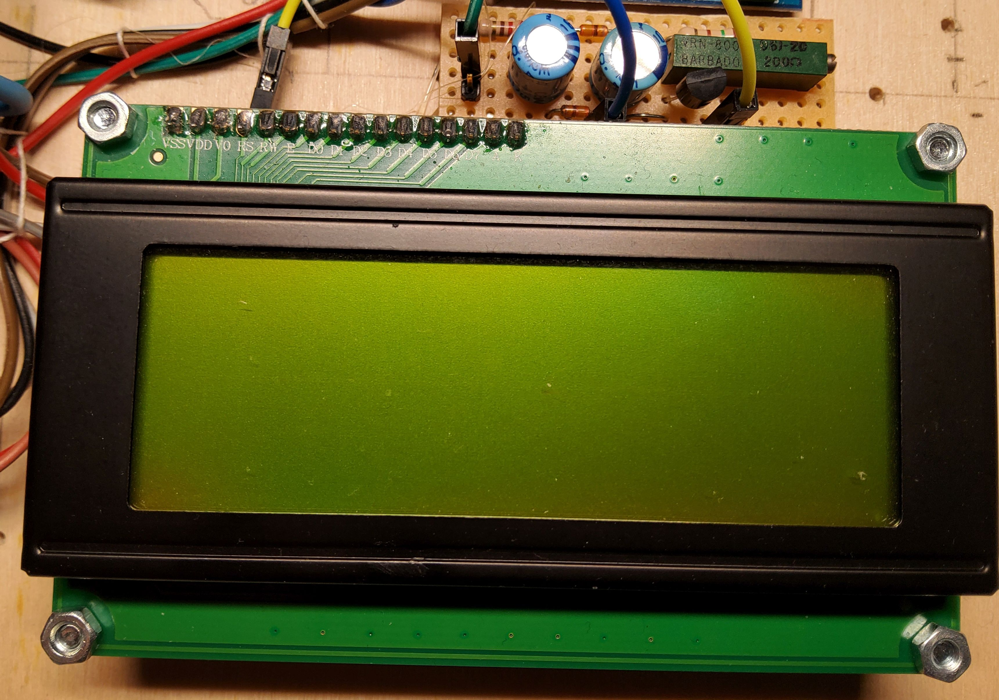

# PD-PPS-Controller
Interface for USB Type C Chargers with PD/PPS

##### Table of contents
- [credits](#credits)
- [motivation](#motivation)
- [the hardware V1.0](#the-hardware-V1.0)
    - [voltage and current sensor](#voltage-and-current-sensor)
    - [PD-Micro](#PD-Micro)
    - [FT232](#FT232)
    - [LCD](#LCD)
    - [switch](#switch)
- [the features](#the-features)
    - [basic features](#basic-features)
    - [advanced features](#advanced-features)
- [the menu](#the-menu)
    - [main menu](#main-menu)
    - [profile menu](#profile-menu)
- [](#)
- [](#)
- [](#)
- [](#)

## credits
This project originates in a colaboration with [embres GmbH](https://www.embres.de/).  
They did a great job in 
- supporting in sourcing of parts
- PCB desgin
- manufacturing PCBs


## motivation
There are some interesting boards out there to trigger USB Type C power delivery sources. Such as the ZY12PDN.  
  
You can find many details at [Manuel Bl.](https://github.com/manuelbl/zy12pdn-oss). These modules allow you to
step through the available fixed profiles which include 5 V, 9 V, 12 V, 15 V and 20 V.
There are many others out there, some have selectable voltage through resistors or jumpers.  
I managed to get my hands on one the utilises a HUSB238 chip from [Hynetek](https://en.hynetek.com/). This one
is programmable either through resistors or a microcontroller using I2C.  

Unfortunatly this is well  below the capabilities of a PD 3.0 compliant power supply. All these modules use only so 
called fixed profiles. But there is the PPS Mode (porgrammable power supply). This uses the augmented profile.
The Augmented Profiles is spacified from 3.3 V to 21 V and up to 5 A. The voltage can be selected in 20 mV steps
and the maximum current can be selected in 50 mA steps.  

And here is my idea: Have you ever used one of those chunky lab power supplies eating up most space on your desk?
These power supplies often range from 0 - 30 V and 0 - 5 A. As far as I am concerned, I mostly use 5 - 15 V at a
few amps.  

What if we can use this augmented profile to mimic a lab power supply? We would nee a chip which is capable of 
requesting this profile from a suitable PPS capable USB Type C power supply.  
Well there is the easy and the hard way:  
The easy way would be to tell some chip to request the desired voltage form the power supply.  

Such a chip is the AP33772 available from [Diodes Incorporated](https://www.diodes.com/). You can get a dedicated 
evaluation board form Diodes or other manufacturers eg. [MICROE](https://www.mikroe.com/). This is the 
***USB-C sink 2 click*** form MICROE:  
  
This chip has been marked as NRND and was replaced by the AP33772S. The "S" version is even easier to use but has a huge
downside: It allows only 100 mV and 250 mA steps.  

The hard way is to use one of those USB-C PD phys. they provide a OSI 0 + 1 interface to the power supply. Higher
levels have to be implemented in SW. The most commonly used chip seems to be the FUSB302 form 
[ON Semiconductor](https://www.onsemi.com/). This chip was used in the original ZY12PDN.

And here it is:  
  
This is the [PD-Micro](https://github.com/ryan-ma/PD_Micro) deigned by Ryan Ma. It is Aruduino Pro Micro with
the FUSB302, some LEDs, a power switch and a voltage regulator. Ryan has made it easy to select appropiate 
profiles. [Kai Clemens Liebich](https://github.com/kcl93) has made some improvements to Ryan's
[FUSB302 lib](https://github.com/kcl93/fusb302_arduino).  

The only problem is voltage stability. Even when using 5 A USB C cables the voltage drop is quite significant.
So we might need to measure the output voltage to fine adjust the power supply voltage. The frist idea was to use
the internal ADC with an external 2.048 V voltage eference. The problem is, this is only a 10 bit ADC, but we need
to measure voltages up to 21 V. Assuming we clip at 20.48 V we will have a resolution of 20 mV. This seems to be
just enough but we can easyly do better. When using a dedicated ADC e.g. The INA219  
  
We can improve the precision to 4 mV. This is well below the 20 mV stepsize. An we get an current sensor on top.  

Now we can set a voltage, enable the output and measure the output voltage and current. So we can write a few 
lines of code to implement a constant voltage / current source. Well the reagulator response time will be 
limited by the speed of the power supply but it is within reasonable limits depenting on your USB power supply. 
My PS is an outdated Ugreen Nexode 2 with 100W which switches in ~40 .. 50 ms.  

But how is the voltage nad current slectet?
Well we could use a serial interface and a computer to "remote control" the circuit. But what about an LCD a 
rotary switch as UI?.

And this leads me to my first prototype.

## the hardware V1.0
  

and here are the components clockwise beginnign with the upper left.  

### voltage and current sensor
  
This is the voltage and current sensor. The shunt resistor has been reduce to R015 to get a 5 A full scale reading.  
There is a serial EEPROM 24C256 on the board. This is used for parameter storage. I could have used the Atmel's on 
chip EEPROM but this has way less wear resistance. I did not know how many write cycles would be needed, so i chose
an externel EEPROM

### PD-Micro
  
This is the heart of the circuit. 

### FT232

The USB - C port of the PD-Micro is occupied by the power supply. The USB interface can't be use for communication.
The HW serial interface is therfore wired to an FT232 USB to serial chip.

### LCD
  
This is an 16x4 HD44780 compatible display with PCF8574, voltage inverter and current source for contrast as described 
in my [LCD library](https://github.com/Ueberspannung/LCD44780).

### switch
left to the display there is a [KY-040](https://github.com/Ueberspannung/RotaryEncoderSwitch) rotary encoder switch. 
Right above the switch there is just a I2C and VCC bus bar.  

## the features
What features does a lab power supply need?  
- adjustable voltage in constant voltage mode
- adjustable current in constant current mode
- automatic switching froma constant voltage to constant current and vice versa

### basic feautres
- it has to be possible to adjust voltage and current settings
    - there needs to be a possibility to selct a profile  
      - when selecting a fixed profile there are no further options  
	    a fixed profile wil be requested with maximum available current
	  - when selecting an augmented profile voltage and current can be selected

### advanced features
- providing "regulated" output (only possible with augmented profile)  
  this will be optional. There will be four options
    - no regulation  
      the system will set the selected valuse only
    - constant voltage  
      the system will try to adjust the output voltage within 20 mV  
      no current active current limiting will be used. This will be done 
      by the power supply.	  
    - constant voltage and constant current
	  when the current exceeds the desired value the voltage will be reduced  
	  this will be assisted by the power supllies current limiting function
    - constant voltage and constant current maximum
	  in this mode the current limiting of the power supply will be set to max.  
	  The current limiting is done in sw only. This prevents the power supply from
	  going into overcurrent shutdown
- automatic resume after power loss
    - no automatic resume
	  the system will start in default profile (5 V) with power switch off
    - automatic resume voltage
	  the system will restore the last power setting but keeps the power switch off
	- automatic power on
	  the last power settings will be restored and the power switch will be turned on
- calibration of the current measurent  
  When drawing a known current form the circuit one can calibrate the current measurement
  by entering ths specific value
- brightness adjustment of the display


## the menu

On startup the system will display a version and build message before starting in main menu.
```
 PD/PPS-Controller  
====================
Ver. :   3.3 nbl    
Build:   mmm dd yyyy
```

after initializiation is completed the main menu will be displayed

### main menu
```
Mode (x:...) [UI^] ! 
     UU.UU V  I.II A
OUT  UU.UU V  I.II A
[i  i  i  i  i]  (i)
```

last line i: menu icons

Example:


to select a menu item press the button, a cursor will appear. Turn rotary switch until 
cursor is at the position of the desired item. Press button again to select the menu.
In this menu the "V" and "A" in the second line are menu items too.
Select to adjust desired voltage or current.

- first line  
The currently selcted profile type will be displayed.  
in this case it is a fixed profile.
If an augmented profile is selcted the selected refgulater mode will be displayed at the end
of the line.
    - U means constant voltage
    - UI means constant voltage and current limited by SW and PS hardware.
    - UI^ means constant voltage and current limited in SW, no hw support
- second line  
The selected voltage and current rating is displayed.
- third line  
The output voltage and current is displayed  
- fourth line  
The available menu item are listed in []. The current menu is displayed at the end of the line in ()  
    1. icon: switch  
    select to turn the output on or off.
    2. icon: flash  
    select to enter the profile menu
    3. icon: wrench  
    select to enter settings menu
    4. icon: check mark  
    when voltage or current settings have been modified only icon 4 and 5 ar active. One need to 
    either accept or discard the changes
    5. icon: cancel "x" 
    see icon 4
    6. icon: ramp
    Current menu. The ramp icon indicates the increment or decrement function of the main menu.

### profile menu
this menu is used to select the desired PD profile.
```
 # 1 / n  (...)     
U= UU.UU V - UU.UU V
I=  I.II A max      
[i  i  i]        (i)
```

last line i: menu icons

Examples:  

  


to select a profile press the button navigate to the "#" symbol in the first line and press 
again to enter profile selection. Turning will step through avalabla profiles. To select a 
profile press again and navigate to the check mark in the buttom line or select "x" to abort.

- first line  
The number of the current profile, the total number of profiles and the profile type (fixed, augmented ...)
is displayed   
- second line  
The nominal voltage or voltage range of the current profile is displayed  
- third line  
The maximum available current in the profile is displayed
- fourth line 
The available menu item are listed in []. The current menu is displayed at the end of the line in ()  
    1. icon: ramp  
    select to return to main menu.
    2. icon: check mark  
    select to accept the new profile
    3. icon: cancel "x"  
	select to discard changes  
    4. icon: flash  
	current menu. The flash indicates the power profile selction menu


## comment on USB type C cahrgers
My Charger supports 5 V / 9 V / 12 V / 15 V @ 3A and 20 V @ 5A fixed profiles and 3.3 V - 21 V @ 5 A augmented 
profile. Be careful many chargers marked with 100W (even Ugreen) will only support 65 W PPS (3.25 A) with 
limited voltage range. They may not supprot voltages below 3.3 V. Some will even have two PPS profiles with
differnet voltage / current ratings.


