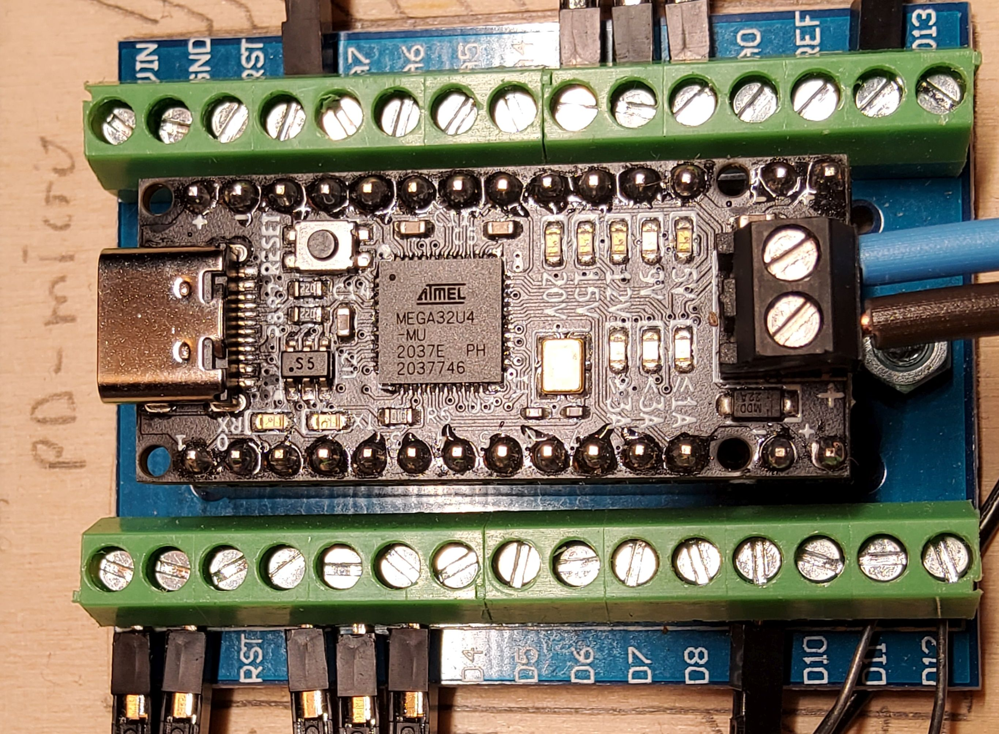
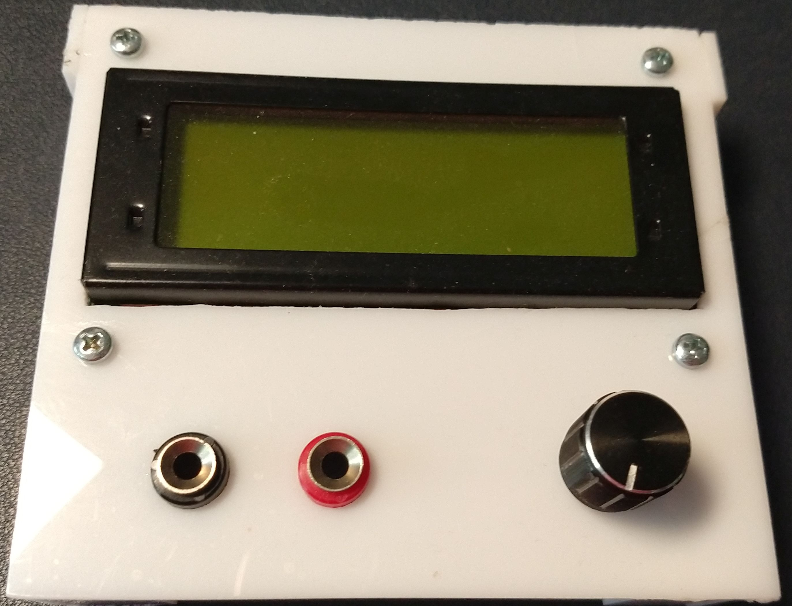

# PD-PPS-Controller
Interface for USB Type C Chargers with PD/PPS

##### Table of contents
- [credits](#credits)
- [motivation](#motivation)
- [AVR prototype](#AVR-prototype)
	- [the hardware](#the-hardware)
		- [voltage and current sensor](#voltage-and-current-sensor)
		- [PD-Micro](#PD-Micro)
		- [FT232](#FT232)
		- [LCD](#LCD)
		- [switch](#switch)
	- [the features](#the-features)
		- [basic features](#basic-features)
		- [advanced features](#advanced-features)
	- [the menu](#the-menu)
		- [menu icons](#menu-icons)
		- [main menu](#main-menu)
		- [profile menu](#profile-menu)
		- [settings menu](#settings-menu)
		- [calibration menu](#calibration-menu)
	- [the software](#the-software)
	    - [build instructions](#build-instructions)
- [ARM prototype](#ARM-prototype)
	- [the first ARM hardware](#the-first-ARM-hardware)
        - [necessary rework on first ARM hardware](#necessary-rework-on-first-ARM-hardware)
    - [menu modifications](#menu-modifications)
        - [new calibration menu](#new-calibration-menu)
    - [ARM software](#ARM-software)
        - [work in progress](#work-in-progress)
        - [ARM build instructions](#ARM-build-instructions)
- [comment on USB type C chargers](#comment-on-USB-type-C-chargers)
    - [tested chargers](#tested-chargers)
    - [issues](#issues)
        - [power supply resets](#power-supply-resets)
        - [power bank resets after 10s](#power-bank-resets-after-10s)

## credits
This project originates in a colaboration with [embres GmbH](https://www.embres.de/).  
They did a great job in 
- supporting in sourcing of parts
- PCB desgin
- manufacturing PCBs


## motivation
There are some interesting boards out there to trigger USB Type C power delivery sources. Such as the ZY12PDN.  
  
You can find many details at [Manuel Bl.](https://github.com/manuelbl/zy12pdn-oss). These modules allow you to
step through the available fixed profiles which include 5 V, 9 V, 12 V, 15 V and 20 V.
There are many others out there, some have selectable voltage through resistors or jumpers.  
I managed to get my hands on one the utilises a HUSB238 chip from [Hynetek](https://en.hynetek.com/). This one
is programmable either through resistors or a microcontroller using I2C.  

Unfortunatly this is well  below the capabilities of a PD 3.0 compliant power supply. All these modules use only so 
called fixed profiles. But there is the PPS Mode (porgrammable power supply). This uses the augmented profile.
The Augmented Profiles is spacified from 3.3 V to 21 V and up to 5 A. The voltage can be selected in 20 mV steps
and the maximum current can be selected in 50 mA steps.  

And here is my idea: Have you ever used one of those chunky lab power supplies eating up most space on your desk?
These power supplies often range from 0 - 30 V and 0 - 5 A. As far as I am concerned, I mostly use 5 - 15 V at a
few amps.  

What if we can use this augmented profile to mimic a lab power supply? We would nee a chip which is capable of 
requesting this profile from a suitable PPS capable USB Type C power supply.  
Well there is the easy and the hard way:  
The easy way would be to tell some chip to request the desired voltage form the power supply.  

Such a chip is the AP33772 available from [Diodes Incorporated](https://www.diodes.com/). You can get a dedicated 
evaluation board form Diodes or other manufacturers eg. [MICROE](https://www.mikroe.com/). This is the 
***USB-C sink 2 click*** form MICROE:  
  
This chip has been marked as NRND and was replaced by the AP33772S. The "S" version is even easier to use but has a huge
downside: It allows only 100 mV and 250 mA steps.  

The hard way is to use one of those USB-C PD phys. they provide a OSI 0 + 1 interface to the power supply. Higher
levels have to be implemented in SW. The most commonly used chip seems to be the FUSB302 form 
[ON Semiconductor](https://www.onsemi.com/). This chip was used in the original ZY12PDN.

And here it is:  
  
This is the [PD-Micro](https://github.com/ryan-ma/PD_Micro) deigned by Ryan Ma. It is Aruduino Pro Micro with
the FUSB302, some LEDs, a power switch and a voltage regulator. Ryan has made it easy to select appropiate 
profiles. [Kai Clemens Liebich](https://github.com/kcl93) has made some improvements to Ryan's
[FUSB302 lib](https://github.com/kcl93/fusb302_arduino).  

The only problem is voltage stability. Even when using 5 A USB C cables the voltage drop is quite significant.
So we might need to measure the output voltage to fine adjust the power supply voltage. The frist idea was to use
the internal ADC with an external 2.048 V voltage eference. The problem is, this is only a 10 bit ADC, but we need
to measure voltages up to 21 V. Assuming we clip at 20.48 V we will have a resolution of 20 mV. This seems to be
just enough but we can easyly do better. When using a dedicated ADC e.g. The INA219  
  
We can improve the precision to 4 mV. This is well below the 20 mV stepsize. An we get an current sensor on top.  

Now we can set a voltage, enable the output and measure the output voltage and current. So we can write a few 
lines of code to implement a constant voltage / current source. Well the reagulator response time will be 
limited by the speed of the power supply but it is within reasonable limits depenting on your USB power supply. 
My PS is an outdated Ugreen Nexode 2 with 100W which switches in ~40 .. 50 ms.  

But how is the voltage nad current slectet?
Well we could use a serial interface and a computer to "remote control" the circuit. But what about an LCD a 
rotary switch as UI?.

And this leads me to my first prototype.

## avr prototype

### the hardware
  

and here are the components clockwise beginnign with the upper left.  

#### voltage and current sensor
  
This is the voltage and current sensor. The shunt resistor has been reduce to R015 to get a 5 A full scale reading.  
There is a serial EEPROM 24C256 on the board. This is used for parameter storage. I could have used the Atmel's on 
chip EEPROM but this has way less wear resistance. I did not know how many write cycles would be needed, so i chose
an externel EEPROM

#### PD-Micro
  
This is the heart of the circuit. 

#### FT232

The USB - C port of the PD-Micro is occupied by the power supply. The USB interface can't be use for communication.
The HW serial interface is therfore wired to an FT232 USB to serial chip.

#### LCD
  
This is an 16x4 HD44780 compatible display with PCF8574, voltage inverter and current source for contrast as described 
in my [LCD library](https://github.com/Ueberspannung/LCD44780).

#### switch
left to the display there is a [KY-040](https://github.com/Ueberspannung/RotaryEncoderSwitch) rotary encoder switch. 
Right above the switch there is just a I2C and VCC bus bar.  

### the features
What features does a lab power supply need?  
- adjustable voltage in constant voltage mode
- adjustable current in constant current mode
- automatic switching froma constant voltage to constant current and vice versa

#### basic feautres
- it has to be possible to adjust voltage and current settings
    - there needs to be a possibility to selct a profile  
      - when selecting a fixed profile there are no further options  
	    a fixed profile wil be requested with maximum available current
	  - when selecting an augmented profile voltage and current can be selected

#### advanced features
- providing "regulated" output (only possible with augmented profile)  
  this will be optional. There will be four options
    - no regulation  
      the system will set the selected valuse only
    - constant voltage  
      the system will try to adjust the output voltage within 20 mV  
      no current active current limiting will be used. This will be done 
      by the power supply.	  
    - constant voltage and constant current
	  when the current exceeds the desired value the voltage will be reduced  
	  this will be assisted by the power supllies current limiting function
    - constant voltage and constant current maximum
	  in this mode the current limiting of the power supply will be set to max.  
	  The current limiting is done in sw only. This prevents the power supply from
	  going into overcurrent shutdown
- automatic resume after power loss
    - no automatic resume
	  the system will start in default profile (5 V) with power switch off
    - automatic resume voltage
	  the system will restore the last power setting but keeps the power switch off
	- automatic power on
	  the last power settings will be restored and the power switch will be turned on
- calibration of the current measurent  
  When drawing a known current form the circuit one can calibrate the current measurement
  by entering ths specific value
- brightness adjustment of the display


### the menu

#### menu icons

- menu icons
    - ramp: main menu    
      
    - wrench: settings menu  
      
    - flash, profile menu  
      
    - mark symbol: calibration menu  
      
- action icons 
    - check mark: accept modification to values  
      
    - cancel "x": discard changes made to values  
      
    - dustbin: clear all settings, reset to default  
      
    - switch: enable or disable output  
      
- option icons  
    - ramp: slecect automatic voltage power selection after power loss    
      
	- switch: select automatic output enabling after power loss  
	  
    - regulator: regulator setttings  
      
    - asterisk: brightness selection  
      
	


#### startup message
On startup the system will display a version and build message before starting in main menu.
```
 PD/PPS-Controller  
====================
Ver. :   3.3 nbl    
Build:   mmm dd yyyy
```

after initializiation is completed the main menu will be displayed

#### main menu
```
Mode (x:...) [UI^] ! 
     UU.UU V  I.II A
OUT  UU.UU V  I.II A
[i  i  i  i  i]  (i)
```
last line i: menu icons

to select a menu item press the button, a cursor will appear. Turn rotary switch until 
cursor is at the position of the desired item. Press button again to select the menu.
In this menu the "V" and "A" in the second line are menu items too.
Select to adjust desired voltage or current.

- first line  
The currently selcted profile type will be displayed.  
in this case it is a fixed profile.
If an augmented profile is selcted the selected refgulater mode will be displayed at the end
of the line.
    - U means constant voltage
    - UI means constant voltage and current limited by SW and PS hardware.
    - UI^ means constant voltage and current limited in SW, no hw support
- second line  
The selected voltage and current rating is displayed.
- third line  
The output voltage and current is displayed  
- fourth line  
The available menu item are listed in []. The current menu is displayed at the end of the line in ()  
    1. icon: switch  
    select to turn the output on or off.
    2. icon: flash  
    select to enter the profile menu
    3. icon: wrench  
    select to enter settings menu
    4. icon: check mark  
    when voltage or current settings have been modified only icon 4 and 5 ar active. One need to 
    either accept or discard the changes
    5. icon: cancel "x" 
    see icon 4
    6. icon: ramp
    Current menu. The ramp icon indicates the increment or decrement function of the main menu.

#### profile menu
this menu is used to select the desired PD profile.
```
 # 1 / n  (...)     
U= UU.UU V - UU.UU V
I=  I.II A max      
[i  i  i]        (i)
```

last line i: menu icons


to select a profile press the button navigate to the "#" symbol in the first line and press 
again to enter profile selection. Turning will step through avalabla profiles. To select a 
profile press again and navigate to the check mark in the buttom line or select "x" to abort.

- first line  
The number of the current profile, the total number of profiles and the profile type (fixed, augmented ...)
is displayed   
- second line  
The nominal voltage or voltage range of the current profile is displayed  
- third line  
The maximum available current in the profile is displayed
- fourth line 
The available menu item are listed in []. The current menu is displayed at the end of the line in ()  
    1. icon: ramp  
    select to return to main menu.
    2. icon: check mark  
    select to accept the new profile
    3. icon: cancel "x"  
	select to discard changes  
    4. icon: flash  
	current menu. The flash indicates the power profile selction menu


#### settings menu
This menu is used to change the operation mode or calibration value.
``` 
(i)=auto  (*)=.    *
(i)=auto            
(i)=auto            
[i  i  i  x]     (i)
```

[i] or (i) icons in brackets 

- first line  
    - ramp icon for slecting automatic or manual voltage selction after power loss
    - star icon for brightness selection as bar between "o" = min and "*" = max
- second line  	
  switch icon for selection automatic or manual enabling of the output after power loss
- third line  
  regulator icon for enabeling regulator mode: none, CV, CV+CC, CV+CC max 
- fourth line 
The available menu item are listed in []. The current menu is displayed at the end of the line in ()  
    1. icon: ramp  
    select to return to main menu.
	2. icon: mark symbol  
	select to enter calibration menu
    3. icon: check mark  
    select to accept the new settings
    4. icon: cancel "x"  
	select to discard changes  
    5. icon: wrench  
	current menu. The wrench indicates the settings menu


#### calibration menu
```
I= I.III A:  I.III A
                    
                    
[i  i  i  x]     (i)
```
[i] or (i) icons in brackets 

to adjust the current measurment calibration enable output with a load and use a calibrated ampere meter to measure the current.  
enter the settings menu and go to the calibration menu. enter the measured current and select the checkmark
it is reccommended to chose a current as high as possible to gain maximum precision.

- first line  
    - left value
	  last calibration value (editable)
    - right value
	  recent current measurement
- fourth line 
The available menu item are listed in []. The current menu is displayed at the end of the line in ()  
    1. icon: ramp  
    select to return to main menu.
	2. icon: dustbin  
    slect to reset to default state, all manual, default calibration value
    3. icon: check mark  
    select to accept the new profile
    4. icon: cancel "x"  
	select to discard changes  
    5. icon: mark symbol  
	current menu. 

### the software
the AVR SW is written with Arduino IDE. While developing the SW I found out a few things about the system:
- The booltloader on AT32U4 devices (such as Leonardo) takes up 4 kB of program space, that's 1/8 of the total
program space. 
- the AVR is not specified for 16 MHz @ 3.3 V, the clock has to be scaled down when operating at voltages below 5V
- the LCD backlight brightness drops sginificantly from 5 V to 3.3 VCC
- 32 kB is quite small for this project.

after initial succes a quickly ran into issues with FLASH and RAM. You might be able to run the AVR code but I 
recommend to reduce the functionality the free some memory.

and this leads me to rhe second prototype using ATSAMD21G18.


#### build instructions
The software in the AVR folder is as is. Ther will be no further development in this branch. It kind of work but use 
at your own risk.
It only compiles without bootloader, you will need to add the boards.local.txt file from the config folder to
```
C:\Users\_user_\AppData\Local\Arduino15\packages\arduino\hardware\avr\1.8.6\
```
(at least on windows machines) an select ***Arduino Leonardo w/o bootloader*** from the available boars.

You will need [AVRDUDE](https://github.com/avrdudes/avrdude/) and an [USBasp](https://www.fischl.de/usbasp/)  
***Hint: be careful when purchasing one of the cheap clones. They often come with outdated SW and will not work. 
It is no problem to update those but you will need a working USBasp adaptor.***

programmer to flash the SW. For non cli users: [AVRDUESS](https://github.com/ZakKemble/AVRDUDESS) is a great gui for AVRDUDE.   
You might as well use an Arduino Uno as [USB to ISP bridge](https://docs.arduino.cc/built-in-examples/arduino-isp/ArduinoISP/).  
 
## ARM prototype
After my setbacks I tried an Arduino Zero. This board uses the ATSAMD21G18 which is a Cortex M0+ ARM controller running at 
48 MHz. It has 256 kB FLASH and 32 kB RAM and lots of interfaces.
A quick port showed that the SW could be easyly ported from AVR to ARM with almost no issues.

This was the point where we decided to start our first custom PCB avoiding all the problems encountered with the first portotype.
- the CPU runs at 48 MHz @ 3.3 V, so ther is no need for slowing down the CPU wenn reducing the input voltage
- a RGB LED was added to indicate the state of operation
- a CAT4004 was added to control the LCD backlight (we expect a  voltage drop below 4 V Vbus)
- a LM2664 replaced the Villard / Greinacher circuit and frees a port pin
- a USB typ C connector is exclusively used for power supply (using VBUS and CC pins)
- a dedicated protection circuit for USB C pins
- a micro USB connector is used for SW Update and USB to Serial conversion
- the core voltage supply is selctable between USB C und micro USB. so SW Update is possible even when no USB C is connected
- a temperature sensor
- a hardware UART port (Rx/Tx/GND) at 3.3 V level
- some testpads

some headache cause the Vcc supply. Most buck converter circuits need some voltage headroom to operate and "feature" an 
undervoltage lockout circuit. But this is a no go for this circuit. It needs to operate to as low as 3.3 V Vbus. We need an 
undervoltage bypass curcuit to guarantee operation at 3.3 V Vbus. Otherwise the circuit would lock out when VBUS drops below the 
thresholt which is typically 4 V - 4.7 V at 3.3 V output.  
This problem was solved slightly overengineered. We used two 3.3 V regulators which are ored by to ideal diodes.  
The TPS62932 is configured to output 3.45 V. The UVLO is set to 4.55 V and the Enable is set to 5.06 V. This guarantees 
the buck converter operate above 5 V and outputs slightly above 3.3 V so the 3.3 V LDO is disabled savely. The LDO is a 
NCV2951ACDMR2G set to 3.3 V. The dropout voltage is max 450 mV at 100 mA. The current consumption of the circuit is below 50 mA
so we will have an estimated max dropout of 300 mV.   
When the input Voltage is above 5.06 V the LDO is idle and the Vcc is 3.45 V. When the input voltag drops below 4.55 V the buck
converter is disabled and the LDO takes ove, resulting in a Vcc of 3.3 V. When the input voltoge continues to fall, Vcc will 
drop to ~3 V at 3.3 V Vbus.  
The CPU will savely operate down to 2.7 V depending on the brownout settings.

### the first ARM hardware
The PCBA:  
  
  
A working prototype:  
   

#### necessary rework on first ARM hardware
- The output needs a pull down to get a proper zero reading. In order to not to influce the curren measurement the resistor needs 
to be place between the shunt and the power FET.
- the series resistors of the RGB LED need to be matched to the relative brightness
- the current selection of the CAT4004 should be set to ~12 mA / channel, no parallel operation
- the current for the amber LED shall be set to 2 mA ~750R
- the three bin jumper should be populatet instead or R25 
- capacitors have to be added to the rotary encoder switch clock and data pins

### menu modifications
#### new calibration menu
```
Current Calibration 
 internal   I.III A 
 reference  I.III A  
[i  i  i  x]     (i)
```
the current reading and the reference value have been reorganised.

### SAM software

The SW has been refactored and is now USB-PD2. 
in the first SW the control of the power supply was implemente in the menu class. This is been moved to its own controller class.  
A header for TODO reminders has been added
A power supply test class has been added to test profile changes.

#### work in progress
- a GUI will be added to controll the circuit when a VT100 Terminal is connected to micro USB
- a simple protocl will be added to control the device directly from SW when connected either to USB or HW UART


#### SAM build instructions
In order to flash the SW for the first time you will need A JTAG Debug Interface such as 
- [Atmel ICE](https://www.microchip.com/en-us/development-tool/atatmel-ice)
- [Segger J-Link](https://www.segger.com/debug-trace-embedded-systems/)
- any other ARM 3.3 V JTAG / SWD debug probe which is supported by Atmel Studio or Arduino IDE.  
  many cheap ARM debug probes seem to emulate Segger J-Link.   
  you might find your luck with either the mythological greek female warrior or the Forty Thieves form One Thousand and One Nights. 
- maybe an Arduino Zero wich has a EDGB (not tested)

You can use Atmel Studio or the Arduino IDE to flash the Arduio Zero bootloader.  
You can use the Blink Demo as well. Select Sketch -> export binary. The IDE will create a file xxx.ino.with_bootloader.arduino_zero.bin.
Just flash the file. You might need to copy the fuse bits from an Arduino Zero.  
There are some samples in the Fuses folder. Some of the fuses are factory tuned and can not be overwritten.

Once the bootloader works you can flash SW using the SAM-BA bootloader. The SW provided by Microchip has a cli 
which is suitable for all SAM devices supporting SAM-BA and is therefore a bit tricky to use. A much more simple
tool is [Bossa from Shumatech](https://www.shumatech.com/web/products/bossa).

 
## comment on USB type C chargers
My Charger supports 5 V / 9 V / 12 V / 15 V @ 3A and 20 V @ 5A fixed profiles and 3.3 V - 21 V @ 5 A augmented 
profile. Be careful many chargers marked with 100W (even Ugreen) will only support 65 W PPS (3.25 A) with 
limited voltage range. They may not supprot voltages below 3.3 V. Some will even have two PPS profiles with
differnet voltage / current ratings.

### tested chargers
- UGREEN Nexode 2 Port 100W PD-Charger  (Model CD254 #50827)
  Supported Profiles:  
    - Fixed	 	
	    - 5 V / 3 A, 9 V / 3 A, 12 V / 3 A, 15 V / 3 A, 20 V / 5A
    - Augmented 	
	    - 3.3 - 21 V / 5A 

- UGREEN Nexode 100W Desktop Charger (Model CD328 #90928)
  Supported Profiles:  
    - Fixed  
	    - 5 V / 3 A, 9 V / 3 A, 12 V / 3 A, 15 V / 3 A, 20 V / 5A
    - Augmented  	
	    - 3.3 - 21 V / 5A 
         
- Anker PowerPort I 30W PD  
  Supported Profiles:
  - Fixed 		
      - 5 V / 3 A, 9 V / 3 A, 15 V / 2 A, 20 V / 1.5 A

- iLepo USB C Fast Charger 65 W   
  Supported Profiles  
    - Fixed  
        - 5 V / 3 A, 9 V / 3 A, 12 V / 3A, 15 V / 3 A, 20 V / 3.25 A
    - Augmented  
        - 3.3V - 11V 5A

- INIU Power Bank 20000mAh, 22.5W   
  Supported Profiles
    - Fixed  
        - 5 V / 3 A, 9 V / 2.22 A, 12 V / 1.5 A
    - Augmented  
        -5.0 V - 5.9 V / 3 A
        -5.0 V - 11 V / 2 A

### issues

#### power supply resets
Some power suplly seem to reset the power when no current is drawn.  
My "Nexode 100W Desktop Charger" P/N 90928 resets after ~1 h without load. Other chargers don't.

#### power bank resets after 10s
My INIU Power Bank resets with no load within ~10s   

***log with load 20R
```
0006: FUSB302 ver ID:B_revA
0118: USB attached CC1 vRd-3.0
0172: RX Src_Cap id=1 raw=0x53A1
0172:  obj0=0x2A01912C
0172:  obj1=0x0002D0E9
0172:  obj2=0x0003C096
0172:  obj3=0xC076323C
0172:  obj4=0xC0DC3228
0172:    [0] 5.00V 3.00A
0172:    [1] 9.00V 2.33A
0172:    [2] 12.00V 1.50A
0172:    [3] 5.00V-5.90V 3.00A PPS *
0172:    [4] 5.00V-11.00V 2.00A PPS
0176: TX Request id=0 raw=0x1082
0176:  obj0=0x42022628
0186: RX GoodCRC id=0 raw=0x0121
0192: RX Accept id=2 raw=0x05A3
0210: RX PS_RDY id=3 raw=0x07A6
0212: PPS 5.50V 2.00A supply ready
0214: Load SW ON
5214: TX Request id=1 raw=0x1282
5214:  obj0=0x42022628
5222: RX GoodCRC id=1 raw=0x0321
5228: RX Accept id=4 raw=0x09A3
5246: RX PS_RDY id=5 raw=0x0BA6
5246: PPS 5.50V 2.00A supply ready
10248:TX Request id=2 raw=0x1482
10248: obj0=0x42022628
10256:RX GoodCRC id=2 raw=0x0521
10262:RX Accept id=6 raw=0x0DA3
10280:RX PS_RDY id=7 raw=0x0FA6
10280:PPS 5.50V 2.00A supply ready
  ...
```

***log without load:***
```
0006: FUSB302 ver ID:B_revA
0118: USB attached CC1 vRd-3.0
0172: RX Src_Cap id=1 raw=0x53A1
0172:  obj0=0x2A01912C
0172:  obj1=0x0002D0E9
0172:  obj2=0x0003C096
0172:  obj3=0xC076323C
0172:  obj4=0xC0DC3228
0172:    [0] 5.00V 3.00A
0172:    [1] 9.00V 2.33A
0172:    [2] 12.00V 1.50A
0172:    [3] 5.00V-5.90V 3.00A PPS *
0172:    [4] 5.00V-11.00V 2.00A PPS
0176: TX Request id=0 raw=0x1082
0176:  obj0=0x42022628
0186: RX GoodCRC id=0 raw=0x0121
0192: RX Accept id=2 raw=0x05A3
0210: RX PS_RDY id=3 raw=0x07A6
0212: PPS 5.50V 2.00A supply ready
0214: Load SW ON
5214: TX Request id=1 raw=0x1282
5214:  obj0=0x42022628
5222: RX GoodCRC id=1 raw=0x0321
5228: RX Accept id=4 raw=0x09A3
5248: RX PS_RDY id=5 raw=0x0BA6
5248: PPS 5.50V 2.00A supply ready
10250:TX Request id=2 raw=0x1482
10250: obj0=0x42022628
10258:RX GoodCRC id=2 raw=0x0521
10264:RX Accept id=6 raw=0x0DA3
10284:RX PS_RDY id=7 raw=0x0FA6
10284:PPS 5.50V 2.00A supply ready

==> The Power bank resets and defaults to 5V only.

0006: FUSB302 ver ID:B_revA
0118: USB attached CC1 vRd-3.0
0352: TX Get_Src_Cap id=0 raw=0x0087
0704: TX Get_Src_Cap id=0 raw=0x0087
1056: TX Get_Src_Cap id=0 raw=0x0087
```

