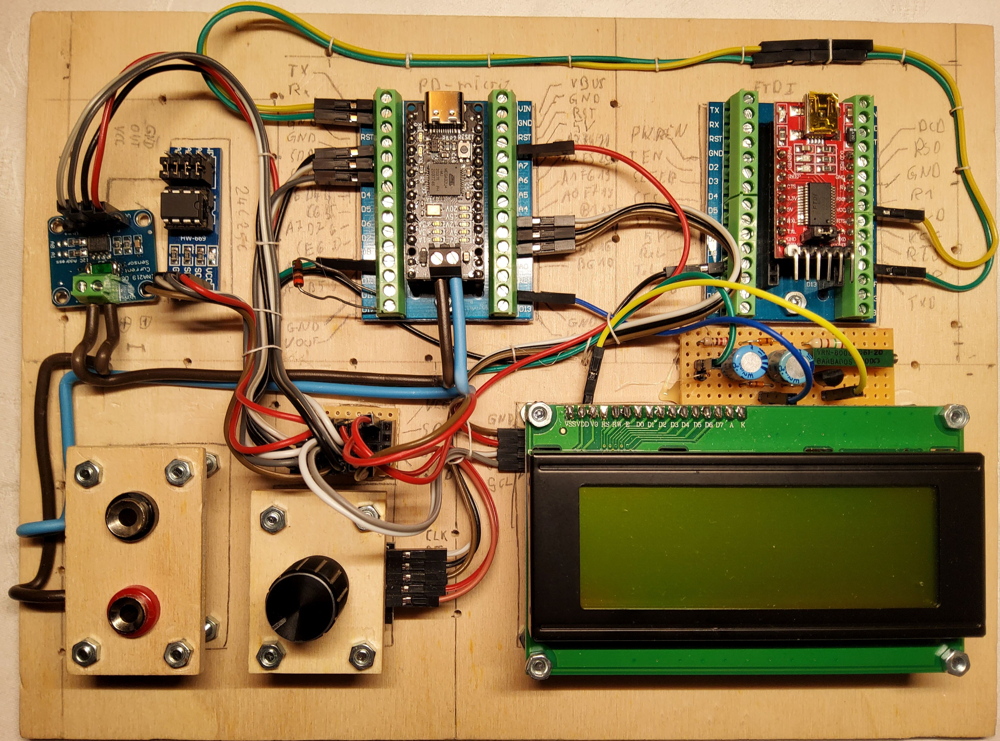

# PD-PPS-Controller
Interface for USB Type C Chargers with PD/PPS

##### Table of contents
- [credits](#credits)
- [motivation](#motivation)
- [hardware](#hardware)
	- [AVR prototype](./DOC/avr.md#Table-of-contents)
		- [the hardware](./DOC/avr.md#the-hardware)
			- [voltage and current sensor](./DOC/avr.md#voltage-and-current-sensor)
			- [PD-Micro](./DOC/avr.md#PD-Micro)
			- [FT232](./DOC/avr.md#FT232)
			- [LCD](./DOC/avr.md#LCD)
			- [switch](./DOC/avr.md#switch)
		- [the features](./DOC/avr.md#the-features)
			- [basic features](./DOC/avr.md#basic-features)
			- [advanced features](./DOC/avr.md#advanced-features)
	- [first ARM prototype](./DOC/arm01.md#Table-of-contents)
		- [the first ARM hardware](./DOC/arm01.md#the-first-ARM-hardware)
		- [necessary rework on first ARM hardware](./DOC/arm01.md#necessary-rework-on-first-ARM-hardware)
	- [the mini](#the-mini)
		- [mini prototype](./DOC/mini.md#mini-prototype)
		  - [the mini hardware](./DOC/mini.md#the-mini-ARM-hardware)
		  - [necessary rework on mini](./DOC/mini.md#necessary-rework-on-mini)
		
		
- the menu
	- [avr menu](./DOC/avr-menu.md)
		- [menu icons](./DOC/avr-menu.md#menu-icons)
		- [main menu](./DOC/avr-menu.md#main-menu)
		- [profile menu](./DOC/avr-menu.md#profile-menu)
		- [settings menu](./DOC/avr-menu.md#settings-menu)
		- [calibration menu](./DOC/avr-menu.md#calibration-menu)
	- [arm menu V1.0](./DOC/arm01-menu.md)
	    - [menu modifications](#menu-modifications)
        - [new calibration menu](#new-calibration-menu)
	- [mini menu](./DOC/mini-menu.md)
		- [menu icons](./DOC/mini-menu.md#menu-icons)
		- [main menu](./DOC/mini-menu.md#main-menu)
		- [profile menu](./DOC/mini-menu.md#profile-menu)
		- [settings menu](./DOC/mini-menu.md#settings-menu)
		- [calibration menu](./DOC/mini-menu.md#calibration-menu)
	- [Terminal menu](./DOC/terminal.md#table-of-contents)
		- [requirements](./DOC/terminal.md#table-of-contents)
		- [suitalble terminal programs](./DOC/terminal.md#suitable-terminal-programs)
		- [screenshots](./DOC/terminal.md#screenshots)
		  - [PuTTY - PPS, CV CC no load](./DOC/terminal.md#PuTTY-PPS-mode-no-load)
		  - [PuTTY - PPS, CV CC load](./DOC/terminal.md#PuTTY-PPS-mode-load)
		  - [PuTTY - PPS, CV CC overload](./DOC/terminal.md#PuTTY-PPS-mode-overload)
		  - [Kermit](./DOC/terminal.md#kermit)
		- [Description](./DOC/terminal.md#description)
		
- [The software](./DOC/sw.md)
  - [AVR SW](./DOC/sw.md#AVR-SW)
    - [build instructions](./DOC/sw.md#AVR-build-instructions)
  - [first ARM prototype SW](./DOC/sw.md#first-ARM-prototype-SW)
    - [first ARM prototype SW](./DOC/sw.md#first-ARM-prototype-SW) 
    - [work in progress](./DOC/sw.md#work-in-progress)
	- [build instructions](./DOC/sw.md#first-ARM-prototyp-SW-build-instructions)
  - [unified sw](./DOC/sw.md#unified-sw)
   - [building the first ARM protype on unified SW](./DOC/sw.md#building-the-first-ARM-protype-on-unified-SW)
   - [building the mini](./DOC/sw.md#building-the-mini)
   - [modification of board definitions for the mini](./DOC/sw.md#modification-of-board-definitions-for-the-mini)
     - [creating the mini board](./DOC/sw.md#creating-the-mini-board)
	 - [description of the mini variant](./DOC/sw.md#description-of-the-mini-variant)
   - [flashing the mini bootloader](./DOC/sw.md#flashing-the-mini-bootloader)
   - [building the mini application](./DOC/sw.md#building-the-mini-application)

- [chargers](./DOC/chargers.md#chargers)
  - [comment on USB type C chargers](./DOC/chargers.md#comment-on-USB-type-C-chargers)
    - [tested chargers](./DOC/chargers.md#tested-chargers)
    - [issues](../DOC/chargers.md#issues)
        - [power supply resets](./DOC/chargers.md#power-supply-resets)
        - [power bank resets after 10s](./DOC/chargers.md#power-bank-resets-after-10s)

## credits
This project originates in a colaboration with [embres GmbH](https://www.embres.de/).  
They did a great job in 
- supporting in sourcing of parts
- PCB desgin
- manufacturing PCBs

## motivation
There are some interesting boards out there to trigger USB Type C power delivery sources. Such as the ZY12PDN.  
  
You can find many details at [Manuel Bl.](https://github.com/manuelbl/zy12pdn-oss). These modules allow you to
step through the available fixed profiles which include 5 V, 9 V, 12 V, 15 V and 20 V.
There are many others out there, some have selectable voltage through resistors or jumpers.  
I managed to get my hands on one the utilises a HUSB238 chip from [Hynetek](https://en.hynetek.com/). This one
is programmable either through resistors or a microcontroller using I2C.  

Unfortunatly this is well  below the capabilities of a PD 3.0 compliant power supply. All these modules use only so 
called fixed profiles. But there is the PPS Mode (porgrammable power supply). This uses the augmented profile.
The Augmented Profiles is spacified from 3.3 V to 21 V and up to 5 A. The voltage can be selected in 20 mV steps
and the maximum current can be selected in 50 mA steps.  

And here is my idea: Have you ever used one of those chunky lab power supplies eating up most space on your desk?
These power supplies often range from 0 - 30 V and 0 - 5 A. As far as I am concerned, I mostly use 5 - 15 V at a
few amps.  

What if we can use this augmented profile to mimic a lab power supply? We would need a chip which is capable of 
requesting this profile from a suitable PPS capable USB Type C power supply.  
Well there is the easy and the hard way:  
The easy way would be to tell some chip to request the desired voltage form the power supply.  

Such a chip is the AP33772 available from [Diodes Incorporated](https://www.diodes.com/). You can get a dedicated 
evaluation board form Diodes or other manufacturers eg. [MICROE](https://www.mikroe.com/). This is the 
***USB-C sink 2 click*** form MICROE:  
  
This chip has been marked as NRND and was replaced by the AP33772S. The "S" version is even easier to use but has a huge
downside: It allows only 100 mV and 250 mA steps.  

The hard way is to use one of those USB-C PD phys. they provide an OSI 0 + 1 interface to the power supply. Higher
levels have to be implemented in SW. The most commonly used chip seems to be the FUSB302 form 
[ON Semiconductor](https://www.onsemi.com/). This chip was used in the original ZY12PDN.

And here it is:  
  
This is the [PD-Micro](https://github.com/ryan-ma/PD_Micro) deigned by Ryan Ma. It is Aruduino Pro Micro with
the FUSB302, some LEDs, a power switch and a voltage regulator. Ryan has made it easy to select appropiate 
profiles. [Kai Clemens Liebich](https://github.com/kcl93) has made some improvements to Ryan's
[FUSB302 lib](https://github.com/kcl93/fusb302_arduino).  

The only problem is voltage stability. Even when using 5 A USB C cables the voltage drop is quite significant.
So we might need to measure the output voltage to fine adjust the power supply voltage. The frist idea was to use
the internal ADC with an external 2.048 V voltage eference. The problem is, this is only a 10 bit ADC, but we need
to measure voltages up to 21 V. Assuming we clip at 20.48 V we will have a resolution of 20 mV. This seems to be
just enough but we can easyly do better. When using a dedicated ADC e.g. The INA219  
  
We can improve the precision to 4 mV. This is well below the 20 mV stepsize. An we get an current sensor on top.  
***Warning on current sensor ACS712***  
The ACS 712 is an easy to use isolated current sensor. But:  
- there are many Fake modules out ther using an relabled ACS704. The fake chips can easyly be found by measuring
cuntinuity between pin 5 and 6. In the ACS704 those pins are shorted while in the ACS712 they are not. The ACS712
has improved stability and nois reduction.
- the ACS712 is very sensitive to VCC stability. 
- the ACS712 is bidirectional and therefore centered aroud 2.5 V for 0 A 
- the ACS712 uses magnetic coupling therefore is sensitive to external magnetic fields and may need complex
magnetic shielding  

  

Now we can set a voltage, enable the output and measure the output voltage and current. So we can write a few 
lines of code to implement a constant voltage / current source. Well the reagulator response time will be 
limited by the speed of the power supply but it is within reasonable limits depenting on your USB power supply. 
My PS is an outdated Ugreen Nexode 2 with 100W which switches in ~40 .. 50 ms.  

But how is the voltage and current slectet?
Well we could use a serial interface and a computer to "remote control" the circuit. But what about an LCD a 
rotary switch as UI?.

And this leads me to my first prototype.

## hardware
### AVR prototype
 	
[AVR prototype](./DOC/avr.md#Table-of-contents)
### first ARM prototype
 
[first ARM prototype](./DOC/arm01.md#Table-of-contents)
### the mini
 
[the mini  protoype](./DOC/mini.md#Table-of-contents)

 
